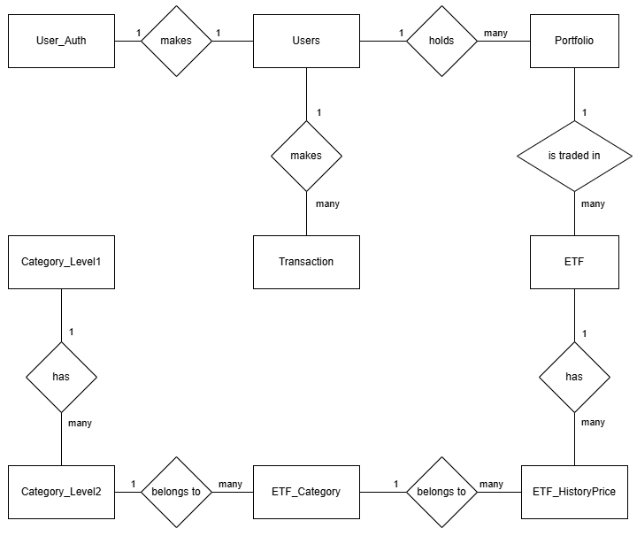
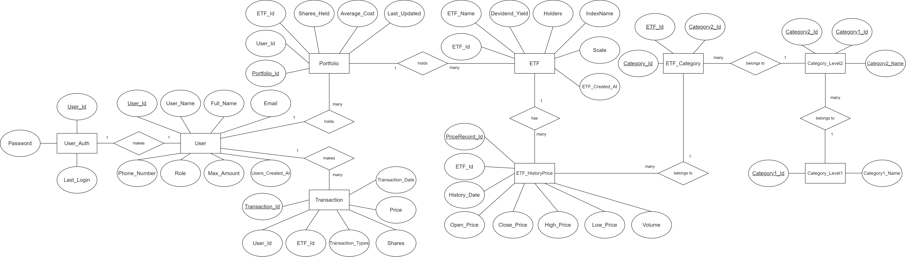

[查看投影片](https://github.com/twl-Benchen/Database_final_porject/blob/main/%E7%AC%AC%E5%85%AB%E7%B5%84_ETF%20%E6%8A%95%E8%B3%87%E7%B5%84%E5%90%88%E7%AE%A1%E7%90%86%E7%B3%BB%E7%B5%B1.pdf)

### 題目 ETF 投資組合管理系統(第八組)
- **專案簡介**  
    協助投資者整合與管理其 ETF 投資資訊，並提供即時的績效及配置。

### 功能概述  

- **用戶管理**  
    註冊、登入及個人資料設定

- **ETF 資料整合**  
    儲存各 ETF 的基本資料（如代碼、名稱、管理公司、規模等）
    記錄歷史價格與市場成交資訊 

- **交易與持倉管理**  
    記錄用戶的每筆買賣交易
    即時計算並更新持倉狀態、成本與盈虧

- **績效與風險評估**  
    產生投資組合資料（收益率、ETF 配置等圖表）
### 成員

>組員一：資工系 - 41143210 - 田晉嘉 [JustinTien10](https://github.com/JustinTien10)<br>
>負責項目：[]

>組員二：資工系 - 41143239 - 陳億穎 [yiyingg1226](https://github.com/yiyingg1226)<br>
>負責項目：[]

>組員三：資工系 - 41143238 -  陳峻宇 [twl-Benchen](https://github.com/twl-Benchen)<br>
>負責項目：[]

>組員四：資工系 - 41143219 -  周偉宸 [WeiChen-Zhou](https://github.com/WeiChen-Zhou)<br>
>負責項目：[]

## 應用情境與使用案例
**應用情境**
1. 小美已經投資了多個ETF和股票，她想要快速了解自己資產的整體表現。透過投資組合管理系統的資產管理功能，她能夠在主頁面上看到當日投資組合的總市值變動及過去一個月的資產趨勢圖。
2. 小張看到晚間新聞說近期因為政府打房措施，使營建相關產業快速崩跌，於是他通過投資組合管理系統檢視該ETF的成分股，發現到他的ETF中有20%的成分股是營建相關產業，這些成分股的股價在近一周跌了約30%。
3. 小王的朋友跟他推薦了一檔ETF，波動低報酬又高，但他想先了解該ETF過去的模擬表現。於是使用我們的投資組合管理系統進行回測分析，計算出該ETF在歷史最大跌幅及年化報酬率，並比較了該ETF與市場上其他ETF的波動差異。

**使用案例**  
 
 - 使用者
   - 檢視ETF資訊與技術指標
   - 使用ETF篩選器
   - 建立與追蹤自訂投資組合
 - 說明
   - 使用者可以查看ETF的歷史走勢、技術指標（如MACD、RSI等），對應「ETF_HistoryPrice(ETF歷史價格) 」​
   - 依據主題、報酬率、產業等條件，快速找到符合需求的ETF ，對應「 Category_Level1(第一分類) 」與「 Category_Level2(第二分類) 」​
   - 建立個人化投資組合，追蹤其報酬變化與模擬股息再投入，對應「 Transaction(交易紀錄表) 」​
 - 管理者
   - 查看使用者資料
   - 更新ETF資料
   - 管理資料庫內容
 - 說明
   - 查看使用者資料，包括登入帳號、持股資料、投資組合等資訊，對應「 Users(使用者基本資料) 」與​「Portfolio(持倉資料表) 」
   - 每日更新ETF數據、技術指標、股息資訊等，對應「ETF(基本資料表) 」
   - 管理資料庫結構與資料，處理資料異常或系統升級
## 系統需求說明
- **交易與持倉管理**
  - 紀錄用戶每筆交易（含交易成本、價格、數量等）
  - 根據交易自動更新用戶當前持倉狀態與盈虧
  - 支援用戶調整 ETF 投資組合以因應市場變動

- **ETF 資料篩選**
  - 儲存與管理 ETF 基本資料（代碼、名稱、管理公司、規模等）
  - 記錄 ETF 的歷史價格與市場每日成交資訊
  - 提供 ETF 分類、查詢與比較功能
  - 支援自訂篩選條件以滿足用戶查詢需求

- **績效與風險評估**
  - 自動計算年化報酬率、波動度、最大跌幅等績效指標
  - 生成績效走勢圖

- **用戶管理**
  - 註冊與個人資料設定（姓名、信箱、單日買賣上限等）
  - 允許用戶登入與修改個人資訊
  - 用戶可查詢歷史交易記錄與投資組合變化
  - 管理員僅可查詢用戶統計數據（無法查看個人持股資料）

- **安全性**
  - 確保用戶個人資料與交易記錄的隱私性
  - 提供資料備份以確保系統穩定性

## 完整性限制(Database Schema)


### ETF 基本資料表 (ETF)

| 欄位名稱            | 資料型態       | 是否可為空 | 欄位說明   | 值域                               | 實際資料舉例            |
| ------------------- | -------------- | ---------- | ---------- | -------------------------------- | ---------------------- |
| ETF_Id (PK)         | VARCHAR(10)    | N          | ETF 代號   | 數字 + 英文字串                  | 0050                  |
| ETF_Name            | VARCHAR(100)   | N          | ETF 名稱   | 長度 1~100 的文字                | 元大台灣50             |
| Devidend_Yield      | DECIMAL(5,2)   | N          | 殖利率     | ≥ 0，最多小數第 2 位              | 2.15                  |
| Holders             | INT            | N          | 持有人數   | ≥ 0 的整數                       | 900000                |
| IndexName           | VARCHAR(50)    | N          | 追蹤指數   | 長度 1~50 的文字                 | 台灣50指數             |
| Scale               | INT            | N          | 規模 (億)  | ≥ 0 的整數                       | 5000                 |
| ETF_Created_At      | TIMESTAMP      | N          | 創立時間   | 時間格式：YYYY-MM-DD             | 2003-06-30            |

| 欄位名稱             | 值域限制說明                                                               | 確認方式（MySQL）                                         |
| ---------------- | -------------------------------------------------------------------- | ------------------------------------------------- |
| ETF\_Id (PK)     | 必須為 1 到 10 個字元長度的字串，僅可包含阿拉伯數字（0–9）與英文字母（A–Z、a–z），且不可為空，用以唯一識別每檔 ETF。 | `CHECK (ETF_Id REGEXP '^[0-9A-Za-z]{1,10}$')`          |
| ETF\_Name        | 必須為 1 到 100 個字元長度的文字，可包含中英文、數字、空格及常見標點符號，且不可為空，用以顯示 ETF 的完整名稱。       | `CHECK (CHAR_LENGTH(ETF_Name) BETWEEN 1 AND 100)` |
| Devidend\_Yield  | 必須為大於或等於 0 且最多保留兩位小數的十進位數，範圍下限為 0.00，無上限限制，用以表示該檔 ETF 的年度配息殖利率。      | `CHECK (Devidend_Yield >= 0)`                     |
| Holders          | 必須為大於或等於 0 的整數，且不可為空，用以統計目前持有該 ETF 的投資人總數。                           | `CHECK (Holders >= 0)`                            |
| IndexName        | 必須為 1 到 50 個字元長度的文字，可包含中英文、空格及常見標點符號，且不可為空，用以記錄該 ETF 所追蹤的基準指數名稱。     | `CHECK (CHAR_LENGTH(IndexName) BETWEEN 1 AND 50)` |
| Scale            | 必須為大於或等於 0 的整數，且不可為空，以「億元」為單位表示該 ETF 的管理規模，實際儲存時以整數形式存放。             | `CHECK (Scale >= 0)`                              |
| ETF\_Created\_At | 必須符合 YYYY-MM-DD 的日期格式，且為有效日期，表示該 ETF 的成立時間，不可為空，不得填入未來日期。            | `CHECK (ETF_Created_At <= CURRENT_DATE)`          |


```sql
-- 建立 ETF 資料表
CREATE TABLE ETF (
  ETF_Id VARCHAR(10) PRIMARY KEY,
  ETF_Name VARCHAR(100) NOT NULL,
  Devidend_Yield DECIMAL(5,2) NOT NULL,
  Holders INT NOT NULL,
  IndexName VARCHAR(50) NOT NULL,
  Scale INT NOT NULL,
  ETF_Created_At DATE NOT NULL,
  CHECK (ETF_Id REGEXP '^[0-9A-Za-z]{1,10}$'),
  CHECK (CHAR_LENGTH(ETF_Name) BETWEEN 1 AND 100),
  CHECK (Devidend_Yield >= 0),
  CHECK (Holders >= 0),
  CHECK (CHAR_LENGTH(IndexName) BETWEEN 1 AND 50),
  CHECK (Scale >= 0)
);

-- 範例：插入0050 (台灣50) 之ETF資料
INSERT INTO ETF (ETF_Id, ETF_Name, Devidend_Yield, Holders, IndexName, Scale, ETF_Created_At)
VALUES ('0050', '元大台灣50', 4.20, 500000, '臺灣50指數', 250, '2003-06-25');
``` 
---
### 交易紀錄表 (Transaction)
 
| 欄位名稱               | 資料型態                 | 是否可為空 | 欄位說明     | 值域                                     | 實際資料舉例          |
| ---------------------- | ------------------------ | ---------- | ------------ | ------------------------------------- | -------------------- |
| Transaction_Id (PK)    | INT                      | N          | 交易代號     | 從 1 開始遞增的整數                     | 1                    |
| User_Id (FK)           | VARCHAR(50)              | N          | 使用者代號   | 參考 Users.User_Id                     | 1                    |
| ETF_Id (FK)            | VARCHAR(10)              | N          | ETF 代號     | 參考 ETF.ETF_Id                        | 0050                |
| Transaction_Type       | ENUM('Buy','Sell')       | N          | 交易類型     | 僅可為 'Buy' 或 'Sell'                  | Buy                  |
| Shares                 | INT                      | N          | 買賣股數     | > 0 的整數                             | 100                  |
| Price                  | DECIMAL(10,2)            | N          | 交易價格     | ≥ 0，最多小數第 2 位                    | 125.50                |
| Transaction_Date       | TIMESTAMP                | N          | 交易時間     | 時間格式：YYYY-MM-DD                    | 2025-05-05           |

| 欄位名稱                 | 值域限制說明                                                | 確認方式（MySQL）                                    |
| -------------------- | ----------------------------------------------------- | -------------------------------------------- |
| Transaction\_Id (PK) | 必須為從 1 開始連續遞增且大於等於 1 的整數，且不可為空，用於唯一識別每一筆交易。           | `CHECK (Transaction_Id >= 1)`                |
| User\_Id (FK)        | 必須為長度不超過 50 個字元的字串，且不可為空，且其值必須對應至 Users 表中的 User\_Id。 | `CHECK (char_length(User_Id) <= 50)`         |
| ETF\_Id (FK)         | 必須為長度 1 至 10 個字元的字串，且不可為空，且其值必須對應至 ETF 表中的 ETF\_Id。   | `CHECK (ETF_Id REGEXP '^[0-9A-Za-z]{1,10}$')`     |
| Transaction\_Type    | 僅可接受字串 'Buy' 或 'Sell'，且不可為空，用以區分買入或賣出交易類型。            | `CHECK (Transaction_Type IN ('Buy','Sell'))` |
| Shares               | 必須為大於 0 的整數，且不可為空，用以表示此筆交易的股數。                        | `CHECK (Shares > 0)`                         |
| Price                | 必須為大於或等於 0 且最多保留兩位小數的十進位數，且不可為空，用以記錄每單位交易價格。          | `CHECK (Price >= 0)`                         |
| Transaction\_Date    | 必須符合 YYYY-MM-DD 格式的有效日期，且不可為空，用以記錄交易發生的日期，不得為未來日期。    | `CHECK (Transaction_Date <= CURRENT_DATE)`   |


```sql
-- 建立交易紀錄表
CREATE TABLE `Transaction` (
  Transaction_Id INT PRIMARY KEY AUTO_INCREMENT,
  User_Id VARCHAR(50) NOT NULL,
  ETF_Id VARCHAR(10) NOT NULL,
  Transaction_Type ENUM('Buy','Sell') NOT NULL,
  Shares INT NOT NULL,
  Price DECIMAL(10,2) NOT NULL,
  Transaction_Date DATE NOT NULL,
  FOREIGN KEY (User_Id) REFERENCES Users(User_Id),
  FOREIGN KEY (ETF_Id) REFERENCES ETF(ETF_Id)
);

-- 範例：記錄001使用者於2025-04-29買進0050 100股，單價167.80
INSERT INTO `Transaction` (User_Id, ETF_Id, Transaction_Type, Shares, Price, Transaction_Date)
VALUES (1, '0050', 'Buy', 100, 168.80, '2025-04-29');
```

---
### 持倉資料表 (Portfolio)

| 欄位名稱               | 資料型態       | 是否可為空 | 欄位說明     | 值域                                     | 實際資料舉例          |
| ---------------------- | -------------- | ---------- | ------------ | ------------------------------------- | -------------------- |
| Portfolio_Id (PK)      | INT            | N          | 持倉代號     | 從 1 開始遞增的整數                      | 1                    |
| User_Id (FK)           | VARCHAR(50)    | N          | 使用者代號   | 參考 Users.User_Id                      | 1                    |
| ETF_Id (FK)            | VARCHAR(10)    | N          | ETF 代號     | 參考 ETF.ETF_Id                        | 0050                |
| Shares_Held            | INT            | N          | 持有股數     | > 0 的整數                             | 500                   |
| Average_Cost           | DECIMAL(10,2)  | N          | 平均成本     | ≥ 0，最多小數第 2 位                    | 175                |
| Last_Updated           | TIMESTAMP      | N          | 最後更新日期 | 時間格式：YYYY-MM-DD                    | 2025-05-06           |

| 欄位名稱               | 值域限制說明                                      | 確認方式（MySQL）                                |
| ------------------ | ------------------------------------------- | ---------------------------------------- |
| Portfolio\_Id (PK) | 必須為從 1 開始連續遞增且大於等於 1 的整數，且不可為空，用以唯一識別持倉紀錄。  | `CHECK (Portfolio_Id >= 1)`              |
| User\_Id (FK)      | 必須為長度不超過 50 個字元的字串，且不可為空，對應 Users.User\_Id。 | `CHECK (CHAR_LENGTH(User_Id) <= 50)`     |
| ETF\_Id (FK)       | 必須為長度 1 至 10 個字元的字串，且不可為空，對應 ETF.ETF\_Id。   | `CHECK (ETF_Id REGEXP '^[0-9A-Za-z]{1,10}$')` |
| Shares\_Held       | 必須為大於 0 的整數，且不可為空，用以表示目前持有該檔 ETF 的股數。       | `CHECK (Shares_Held > 0)`                |
| Average\_Cost      | 必須為大於或等於 0 且最多保留兩位小數的十進位數，且不可為空，用以記錄每股平均成本。 | `CHECK (Average_Cost >= 0)`              |
| Last\_Updated      | 必須符合 YYYY-MM-DD 格式的有效日期，且不可為空，不得為未來日期。      | `CHECK (Last_Updated <= CURRENT_DATE)`   |


```sql
-- 建立持倉資料表
CREATE TABLE Portfolio (
  Portfolio_Id INT PRIMARY KEY AUTO_INCREMENT,
  User_Id VARCHAR(50) NOT NULL,
  ETF_Id VARCHAR(10) NOT NULL,
  Shares_Held INT NOT NULL,
  Average_Cost DECIMAL(10,2) NOT NULL,
  Last_Updated TIMESTAMP NOT NULL DEFAULT CURRENT_TIMESTAMP,
  FOREIGN KEY (User_Id) REFERENCES Users(User_Id),
  FOREIGN KEY (ETF_Id) REFERENCES ETF(ETF_Id)
);

-- 範例：使用者代號1持有0050 100股，平均成本167.80
INSERT INTO Portfolio (User_Id, ETF_Id, Shares_Held, Average_Cost)
VALUES (1, '0050', 100, 167.80);
```

---

### ETF 歷史價格表 (ETF_HistoryPrice)

| 欄位名稱               | 資料型態       | 是否可為空 | 欄位說明     | 值域                                    | 實際資料舉例          |
| ---------------------- | -------------- | ---------- | ------------ | ------------------------------------ | -------------------- |
| PriceRecord_Id (PK)    | INT            | N          | 價格紀錄代號 | 從 1 開始遞增的整數                     | 1                    |
| ETF_Id (FK)            | VARCHAR(10)    | N          | ETF 代號     | 參考 ETF.ETF_Id                       | 0050              |
| Open_Price             | DECIMAL(10,2)  | N          | 開盤價       | ≥ 0，最多小數第 2 位                   | 125.00                |
| Close_Price            | DECIMAL(10,2)  | N          | 收盤價       | ≥ 0，最多小數第 2 位                   | 125.50                |
| High_Price             | DECIMAL(10,2)  | N          | 最高價       | ≥ 0，最多小數第 2 位                   | 126.00                |
| Low_Price              | DECIMAL(10,2)  | N          | 最低價       | ≥ 0，最多小數第 2 位                   | 124.80                |
| Volume                 | BIGINT         | N          | 交易量       | ≥ 0 的整數                            | 3500000              |
| History_Date           | DATE           | N          | 日期         | 時間格式：YYYY-MM-DD                   | 2025-05-05           |

| 欄位名稱                 | 值域限制說明                                     | 確認方式（MySQL）                                |
| -------------------- | ------------------------------------------ | ---------------------------------------- |
| PriceRecord\_Id (PK) | 必須為從 1 開始連續遞增且大於等於 1 的整數，且不可為空，用以唯一識別每筆紀錄。 | `CHECK (PriceRecord_Id >= 1)`            |
| ETF\_Id (FK)         | 必須為長度 1 至 10 個字元的字串，且不可為空，對應 ETF.ETF\_Id。  | `CHECK (ETF_Id REGEXP '^[0-9A-Za-z]{1,10}$')` |
| Open\_Price          | 必須為大於或等於 0 且最多保留兩位小數的十進位數，且不可為空，記錄當日開盤價。   | `CHECK (Open_Price >= 0)`                |
| Close\_Price         | 必須為大於或等於 0 且最多保留兩位小數的十進位數，且不可為空，記錄收盤價。     | `CHECK (Close_Price >= 0)`               |
| High\_Price          | 必須為大於或等於 0 且最多保留兩位小數的十進位數，且不可為空，記錄當日最高價。   | `CHECK (High_Price >= 0)`                |
| Low\_Price           | 必須為大於或等於 0 且最多保留兩位小數的十進位數，且不可為空，記錄當日最低價。   | `CHECK (Low_Price >= 0)`                 |
| Volume               | 必須為大於或等於 0 的整數，且不可為空，用以表示當日成交量。            | `CHECK (Volume >= 0)`                    |
| History\_Date        | 必須符合 YYYY-MM-DD 格式的有效日期，且不可為空，不得為未來日期。     | `CHECK (History_Date <= CURRENT_DATE)`   |


```sql
-- 建立歷史價格表
CREATE TABLE ETF_HistoryPrice (
  PriceRecord_Id INT PRIMARY KEY AUTO_INCREMENT,
  ETF_Id VARCHAR(10) NOT NULL,
  Open_Price DECIMAL(10,2) NOT NULL,
  Close_Price DECIMAL(10,2) NOT NULL,
  High_Price DECIMAL(10,2) NOT NULL,
  Low_Price DECIMAL(10,2) NOT NULL,
  Volume BIGINT NOT NULL,
  History_Date DATE NOT NULL,
  FOREIGN KEY (ETF_Id) REFERENCES ETF(ETF_Id)
);

-- 範例：紀錄2025-04-29 之0050開盤167.15、收盤167.80、最高168.00、最低166.50、成交量10830
INSERT INTO ETF_HistoryPrice (ETF_Id, Open_Price, Close_Price, High_Price, Low_Price, Volume, History_Date)
VALUES ('0050', 167.15, 167.80, 168.00, 166.50, 10830, '2025-04-28');
```

---
### 第一分類表 (Category_Level1)

| 欄位名稱           | 資料型態    | 是否可為空 | 欄位說明     | 值域                               | 實際資料舉例    |
| ------------------ | ----------- | ---------- | ------------ | ------------------------------- | -------------- |
| Category1_Id (PK)  | INT         | N          | 第一分類代號 | 從 1 開始遞增的整數               | 1              |
| Category1_Name     | VARCHAR(20) | N          | 第一分類名稱 | 長度 1~20 的文字                 | 股票型          |

| 欄位名稱               | 值域限制說明                                 | 確認方式（MySQL）                                              |
| ------------------ | -------------------------------------- | ------------------------------------------------------ |
| Category1\_Id (PK) | 必須為從 1 開始連續遞增且大於等於 1 的整數，且不可為空。        | `CHECK (Category1_Id >= 1)`                            |
| Category1\_Name    | 必須為長度 1 到 20 個字元的文字，且不可為空，僅可包含中、英文與數字。 | `CHECK (CHAR_LENGTH(Category1_Name) BETWEEN 1 AND 20)` |


```sql
-- 建立第一分類表
CREATE TABLE Category_Level1 (
  Category1_Id INT PRIMARY KEY AUTO_INCREMENT,
  Category1_Name VARCHAR(20) NOT NULL
);

-- 範例：新增第一分類「股票型」
INSERT INTO Category_Level1 (Category1_Name) VALUES ('股票型');
```

---
### 第二分類表 (Category_Level2)

| 欄位名稱              | 資料型態    | 是否可為空 | 欄位說明       | 值域                                      | 實際資料舉例  |
| --------------------- | ----------- | ---------- | -------------- | -------------------------------------- | ------------ |
| Category2_Id (PK)     | INT         | N          | 第二分類代號   | 從 1 開始遞增的整數                      | 1            |
| Category1_Id (FK)     | INT         | N          | 第一分類代號   | 參考 Category_Level1.Category1_Id       | 1            |
| Category2_Name        | VARCHAR(20) | N          | 第二分類名稱   | 長度 1~20 的文字                        | 市值型        |

| 欄位名稱               | 值域限制說明                                                      | 確認方式（MySQL）                                              |
| ------------------ | ----------------------------------------------------------- | ------------------------------------------------------ |
| Category2\_Id (PK) | 必須為從 1 開始連續遞增且大於等於 1 的整數，且不可為空。                             | `CHECK (Category2_Id >= 1)`                            |
| Category1\_Id (FK) | 必須為大於等於 1 的整數，且不可為空，其值必須對應至 Category\_Level1.Category1\_Id。 | `CHECK (Category1_Id >= 1)`                            |
| Category2\_Name    | 必須為長度 1 到 20 個字元的文字，且不可為空，僅可包含中、英文與數字。                      | `CHECK (CHAR_LENGTH(Category2_Name) BETWEEN 1 AND 20)` |


```sql
-- 建立第二分類表
CREATE TABLE Category_Level2 (
  Category2_Id INT PRIMARY KEY AUTO_INCREMENT,
  Category1_Id INT NOT NULL,
  Category2_Name VARCHAR(20) NOT NULL,
  FOREIGN KEY (Category1_Id) REFERENCES Category_Level1(Category1_Id)
);

-- 範例：新增第二分類「大型權值」屬於第一分類1
INSERT INTO Category_Level2 (Category1_Id, Category2_Name) VALUES (1, '大型權值');
```

---
### 紀錄分類表 (ETF_Category)

| 欄位名稱            | 資料型態    | 是否可為空 | 欄位說明       | 值域                                   | 實際資料舉例    |
| ------------------- | ----------- | ---------- | -------------- | ------------------------------------ | -------------- |
| Category_Id (PK)    | INT         | N          | 紀錄分類代號   | 從 1 開始遞增的整數                    | 1              |
| ETF_Id (FK)         | VARCHAR(10) | N          | ETF 代號       | 參考 ETF.ETF_Id                      | 0050        |
| Category2_Id (FK)   | INT         | N          | 第二分類代號   | 參考 Category_Level2.Category2_Id     | 1              |

| 欄位名稱               | 值域限制說明                                                      | 確認方式（MySQL）                                |
| ------------------ | ----------------------------------------------------------- | ---------------------------------------- |
| Category\_Id (PK)  | 必須為從 1 開始連續遞增且大於等於 1 的整數，且不可為空。                             | `CHECK (Category_Id >= 1)`               |
| ETF\_Id (FK)       | 必須為長度 1 到 10 個字元的字串，且不可為空，其值必須對應至 ETF.ETF\_Id。              | `CHECK (ETF_Id REGEXP '^[0-9A-Za-z]{1,10}$')` |
| Category2\_Id (FK) | 必須為大於等於 1 的整數，且不可為空，其值必須對應至 Category\_Level2.Category2\_Id。 | `CHECK (Category2_Id >= 1)`              |


```sql
-- 建立ETF與分類對應表
CREATE TABLE ETF_Category (
  Category_Id INT PRIMARY KEY AUTO_INCREMENT,
  ETF_Id VARCHAR(10) NOT NULL,
  Category2_Id INT NOT NULL,
  FOREIGN KEY (ETF_Id) REFERENCES ETF(ETF_Id),
  FOREIGN KEY (Category2_Id) REFERENCES Category_Level2(Category2_Id)
);

-- 範例：將0050歸類至第二分類1 (大型權值)
INSERT INTO ETF_Category (ETF_Id, Category2_Id) VALUES ('0050', 1);
```

---
### 使用者基本資料表 (Users)

| 欄位名稱              | 資料型態             | 是否可為空 | 欄位說明       | 值域                              | 實際資料舉例             |
| --------------------- | -------------------- | ---------- | -------------- | ------------------------------- | ----------------------- |
| User_Id (PK)          | INT                  | N          | 使用者代號     | 從 1 開始遞增的整數               | 1                       |
| User_Name             | VARCHAR(50)          | N          | 使用者名稱     | 長度 1~50 的文字                 | alice                   |
| Full_Name             | VARCHAR(100)         | N          | 全名           | 長度 1~100 的文字                 | Alice Chen              |
| Email                 | VARCHAR(100)         | N          | 電子郵件       | Email 格式                       | alice@example.com       |
| Phone_Number          | VARCHAR(10)          | N          | 電話號碼       | 長度固定為 10 碼                  | 0912345678              |
| Role                  | ENUM('user','admin') | N          | 權限           | 僅限 'user' 或 'admin'           | user                    |
| Max_Amount            | INT                  | N          | 當日最大交易量 | ≥ 0 的整數                        | 1000000                 |
| Users_Created_At      | TIMESTAMP            | N          | 帳號創建日期   | 時間格式：YYYY-MM-DD             | 2025-01-01              |

| 欄位名稱               | 值域限制說明                                                 | 確認方式（MySQL）                                                             |
| ------------------ | ------------------------------------------------------ | --------------------------------------------------------------------- |
| User\_Id (PK)      | 必須為從 1 開始連續遞增且大於等於 1 的整數，且不可為空。                        | `CHECK (User_Id >= 1)`                                                |
| User\_Name         | 必須為長度 1 到 50 個字元的文字，且不可為空，可包含英數字、底線及常見標點。              | `CHECK (CHAR_LENGTH(User_Name) BETWEEN 1 AND 50)`                     |
| Full\_Name         | 必須為長度 1 到 100 個字元的文字，且不可為空，可包含中英文及空格。                  | `CHECK (CHAR_LENGTH(Full_Name) BETWEEN 1 AND 100)`                    |
| Email              | 必須符合標準電子郵件格式，且長度不超過 100 個字元，不可為空，用以作為聯絡與驗證依據。          | `CHECK (Email REGEXP '^[A-Za-z0-9._%+-]+@[A-Za-z0-9.-]+\\.[A-Za-z]{2,}$')` |
| Phone\_Number      | 必須為長度固定 10 碼且僅包含數字的字串，格式如 0912345678，且不可為空。            | `CHECK (Phone_Number REGEXP '^[0-9]{10}$')`                                |
| Role               | 僅可接受字串 'user' 或 'admin' 其中之一，且不可為空，用以設定使用者權限等級。        | `CHECK (Role IN ('user','admin'))`                                    |
| Max\_Amount        | 必須為大於或等於 0 的整數，且不可為空，用以限制使用者於單日內可執行之最大交易數量。            | `CHECK (Max_Amount >= 0)`                                             |
| Users\_Created\_At | 必須符合 YYYY-MM-DD 格式的有效日期，且不可為空，用以記錄使用者帳號建立之日期，不得填入未來日期。 | `CHECK (Users_Created_At <= CURRENT_DATE)`                            |


```sql
-- 建立使用者資料表
CREATE TABLE Users (
  User_Id INT PRIMARY KEY AUTO_INCREMENT,
  User_Name VARCHAR(50) NOT NULL,
  Full_Name VARCHAR(100) NOT NULL,
  Email VARCHAR(100) NOT NULL UNIQUE,
  Phone_Number VARCHAR(10) NOT NULL,
  Role ENUM('user','admin') NOT NULL,
  Max_Amount INT NOT NULL DEFAULT 0,
  Users_Created_At TIMESTAMP NOT NULL DEFAULT CURRENT_TIMESTAMP,
  CHECK (CHAR_LENGTH(User_Name) BETWEEN 1 AND 50),
  CHECK (CHAR_LENGTH(Full_Name) BETWEEN 1 AND 100),
  CHECK (Email REGEXP '^[A-Za-z0-9._%+-]+@[A-Za-z0-9.-]+\\.[A-Za-z]{2,}$'),
  CHECK (Phone_Number REGEXP '^[0-9]{10}$'),
  CHECK (Role IN ('user','admin')),
  CHECK (Max_Amount >= 0)
);


-- 範例：新增使用者 Bob (User_Id 自動產生為1)
INSERT INTO Users (User_Name, Full_Name, Email, Phone_Number, Role, Max_Amount)
VALUES ('bob', 'Bob Lee', 'bob@example.com', '0987654321', 'user', 500000);
```


---
### (在其他資料庫)使用者密碼 (Auth)
| 欄位名稱            | 資料型態         | 是否可為空 | 欄位說明  | 值域                         | 實際資料舉例               |
| -------------- | ------------ | ----- | ----- | ------------------------------------------ | ------------------------ |
| User_Id (PK)    | INT          | N     | 使用者代號 | 從 1 開始遞增的整數                     | 1                        |
| Password        | VARCHAR(255) | N     | 使用者密碼 | 長度 1~255 的文字                      | abcdef                 |
| Last_Login      | TIMESTAMP    | N     | 最近登入  | 時間格式：YYYY-MM-DD HH:MM:SS           | 2025-05-06 10:00:00    |

```sql
-- 建立使用者密碼資料表 Auth
CREATE TABLE Auth (
  User_Id INT PRIMARY KEY AUTO_INCREMENT,
  Password VARCHAR(255) NOT NULL,
  Last_Login TIMESTAMP NOT NULL DEFAULT CURRENT_TIMESTAMP
);

-- 範例：新增使用者密碼為 'abcd'
INSERT INTO Auth (Password)
VALUES ('abcd');
```

## ER Diagram及詳細說明
<!---->
**簡略圖**



**完整圖**


**1. 使用者密碼 (User_Auth) 資料表屬性**
- 使用者代號 (User_Id)
- 使用者密碼 (Password)
- 最近登入 (Last_Login)

**2. 使用者基本資料 (Users) 資料表屬性**
- 使用者代號 (User_Id)
- 使用者名稱 (User_Name)
- 全名 (Full_Name)
- 電子郵件 (Email)
- 電話號碼 (Phone_Number)
- 權限 (Role)
- 當日最大交易量 (Max_Amount)
- 帳號創建日期 (Users_Created_At)

**3. 交易紀錄表 (Transaction) 資料表屬性**
- 交易代號 (Transaction_Id)
- 使用者代號 (User_Id)
- ETF 代號 (ETF_Id)
- 交易類型 (Transaction_Type)
- 買賣股數 (Shares)
- 交易價格 (Price)
- 交易時間 (Transaction_Date)

**4. 持倉資料 (Portfolio) 資料表屬性**
- 持倉代號 (Portfolio_Id)
- 使用者代號 (User_Id)
- ETF 代號 (ETF_Id)
- 持有股數 (Shares_Held)
- 平均成本 (Average_Cost)
- 最後更新日期 (Last_Updated)

**5. ETF 基本資料 (ETF) 資料表屬性**
- ETF 代號 (ETF_Id)
- ETF 名稱 (ETF_Name)
- 殖利率 (Devidend_Yield)
- 持有人數 (Holders)
- 追蹤指數 (IndexName)
- 規模 (Scale)
- 創立時間 (ETF_Created_At)

**6. ETF 歷史價格 (ETF_HistoryPrice) 資料表屬性**
- 價格紀錄代號 (PriceRecord_Id)
- ETF 代號 (ETF_Id)
- 開盤價 (Open_Price)
- 收盤價 (Close_Price)
- 最高價 (High_Price)
- 最低價 (Low_Price)
- 交易量 (Volume)
- 日期 (History_Date)

**7. 紀錄分類 (ETF_Category) 資料表屬性**
- 紀錄分類代號 (Category_Id)
- ETF 代號 (ETF_Id)
- 第二分類代號 (Category2_Id)

**8. 第二分類 (Category_Level2) 資料表屬性**
- 第二分類代號 (Category2_Id)
- 第一分類代號 (Category1_Id)
- 第二分類名稱 (Category2_Name)

**9. 第一分類 (Category_Level1) 資料表屬性**
- 第一分類代號 (Category1_Id)
- 第一分類名稱 (Category1_Name)

**10. 關聯**
- 「使用者密碼（Auth）」與「使用者基本資料表（Users）」實體有一對一 (1..1) 的關係，表示：1..1 和 1..1。每筆使用者密碼只能對應一位使用者，而每位使用者也只能有一筆密碼資料。
- 「使用者基本資料表（Users）」與「交易紀錄表（Transaction）」實體有一對多 (1..N) 的關係，表示：1..1 和 0..*。一位使用者可以有零到多筆交易紀錄，但每筆交易紀錄只能屬於一位使用者。
- 「使用者基本資料表（Users）」與「持倉資料表（Portfolio）」實體有一對多 (1..N) 的關係，表示：1..1 和 0..*。一位使用者可以持有零到多筆持倉資料，但每筆持倉資料只能屬於一位使用者。
- 「持倉資料表（Portfolio）」與「ETF」實體有一對多 (1..N) 的關係，表示：1..1 和 0..*。每個 ETF 可以出現在多筆持倉資料中，但一筆持倉只能包含一個 ETF。
- 「ETF」與「ETF 歷史價格表（ETF_HistoryPrice）」實體有一對多 (1..N) 的關係，表示：1..1 和 0..*。一個 ETF 可以有零到多筆歷史價格紀錄，但每筆歷史價格紀錄只能對應一個 ETF。
- 「ETF」與「紀錄分類表（ETF_Category）」實體有一對多 (1..N) 的關係，表示：1..1 和 0..*。每筆分類可以對應多個 ETF，但每個 ETF 只能歸類於一個分類。
- 「紀錄分類表（ETF_Category）」與「第二分類表（Category_Level2）」實體有多對多 (M..N) 的關係，表示：0..* 和 0..*。一筆分類可以包含多個次分類，而一個次分類也可以屬於多個分類。
- 「第一分類表（Category_Level1）」與「第二分類表（Category_Level2）」實體有一對多 (1..N) 的關係，表示：1..1 和 0..*。一個第一分類可以包含多個第二分類，但每個第二分類只能屬於一個第一分類。
