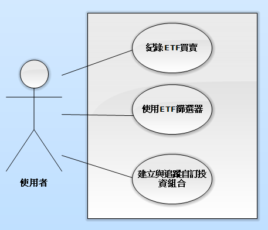
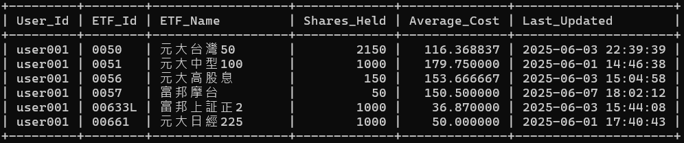
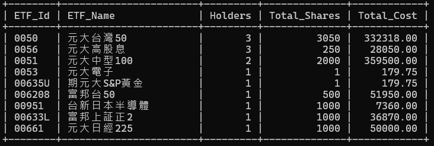
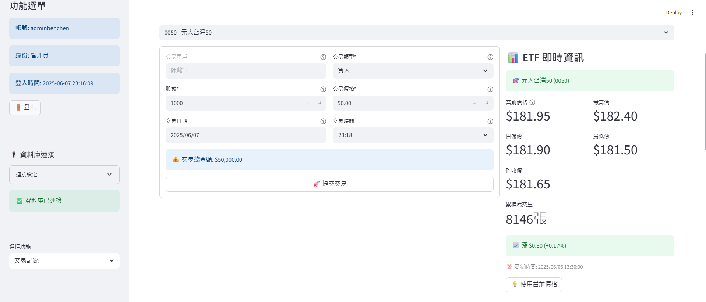

<!--### 檔案
> [!IMPORTANT]
> [簡報PPT](https://nfuedu-my.sharepoint.com/:p:/g/personal/41143210_nfu_edu_tw/EQgLAPpf7q5Mk7CAZIULnywB_r8vQditrzM4sEXGN3AbaA?e=zg3XKR) 、 [WORD](https://nfuedu-my.sharepoint.com/:w:/r/personal/41143238_nfu_edu_tw/Documents/%E8%B3%87%E6%96%99%E5%BA%AB%E5%A0%B1%E5%91%8A.docx?d=w76ed8ff22f6c4671a6c02972e6391e84&csf=1&web=1&e=W4sp4U) 、 [5/14作業](./homework/hw0514.md)<br>-->
## 目錄
1. [應用情境與使用案例](#應用情境與使用案例)
2. [系統需求說明](#系統需求說明)
3. [ER Diagram及詳細說明](#er-diagram及詳細說明)
4. [資料庫Schema及完整性限制](#資料庫Schema及完整性限制)
5. [使用者權限設定](#使用者權限設定)
6. [View](#使用者view16)
7. [DEMO](#demo)
8. [備份&還原資料庫](#備份還原資料庫)
9. [參考資料/處理方式](#參考資料處理方式)
    
## 題目 ETF 投資組合管理系統(第八組)
- **專案簡介**  
    該系統協助投資者整合與管理其 ETF 投資資訊，提供利用標籤查詢ETF、即時交易與持倉更新，並產生投資組合明細與統計。

### 功能概述  

- **用戶管理**  
    註冊、登入及個人資料設定

- **ETF列表與篩選**  
    儲存各 ETF 的基本資料（如代碼、名稱、管理公司、規模等）
    下拉選單顯示所有ETF並支援查詢
  
- **歷史價格與漲跌幅**  
    可以查看台灣所有ETF創立至今(2025/6月)K線圖走勢
    查詢指定期間收盤價並計算漲跌幅百分比
  
- **交易與持倉管理**  
    記錄用戶的每筆買賣交易
    即時計算並更新持倉狀態、成本與盈虧

- **績效與風險評估**  
    產生投資組合資料（收益率、ETF 配置等圖表）
### 成員

>組員一：資工系 - 41143210 - 田晉嘉 [JustinTien10](https://github.com/JustinTien10)<br>
>負責項目：[ETF歷史走勢爬取、編排文件、協助View製作、Github編輯]<br>
>Email：41143210@nfu.edu.tw
>

>組員四：資工系 - 41143219 -  周偉宸 [WeiChen-Zhou](https://github.com/WeiChen-Zhou)<br>
>負責項目：[權限設計&實作、建立View、Github編輯]<br>
>Email：41143219@nfu.edu.tw

>組員三：資工系 - 41143238 -  陳峻宇 [twl-Benchen](https://github.com/twl-Benchen)<br>
>負責項目：[值域規劃、MariaDB建立&實作、建立View、ETF標籤&成分股的爬蟲與整理、網頁實作、Github總編輯]<br>
>Email：41143238@nfu.edu.tw

>組員二：資工系 - 41143239 - 陳億穎 [yiyingg1226](https://github.com/yiyingg1226)<br>
>負責項目：[資料庫概念層建立、ER digram製作、Github編輯、成分股相關設計&實作]<br>
>Email：41143239@nfu.edu.tw
## 應用情境與使用案例
**應用情境**
1. 小美登入後，系統立刻顯示她所有持有的ETF明細（名稱、股數、平均成本及總成本），並自動彙總出不同檔數、總持股與投資金額，同時在下方列出近期交易紀錄，讓她方便掌握自身的資產配置與操作狀況。
2. 小張想找到特定類型的ETF，只要在分類介面先選「股票型」、再點「大型權值」，系統便列出所有符合條件的標的；若他需要更精準，也能直接輸入關鍵字（例如「元大」）進行搜尋，迅速鎖定符合策略的ETF。
3. 小王若要分析一檔ETF的歷史表現，只要選擇期間（如2024至2025年），系統會計算該段漲跌幅，並提供每日K線與成交量資料，協助他評估這檔ETF。

**使用案例**  
  
 - 使用者
   - 紀錄ETF買賣
   - 使用ETF篩選器
   - 建立與追蹤自訂投資組合
 - 說明
   - 使用者可以買入或賣出ETF，，對應「 Transaction(交易紀錄表) 」​
   - 依據標籤（如科技、能源、金融、高股息、ESG等），快速找到符合需求的ETF ，對應「 Category_Level1(第一分類) 」與「 Category_Level2(第二分類) 」​
   - 建立個人化投資組合，追蹤其報酬變化，對應「 Portfolio (持倉資料表) 」​
 - 管理者
   - 查看使用者資料
   - 更新ETF資料
 - 說明
   - 查看使用者帳號資料，對應「 Users(使用者基本資料) 」
   - 更新ETF歷史數據、對應「ETF(基本資料表) 」、 「ETF_HistoryPrice(ETF 歷史價格表)」
 - 資料庫管理者
   - 管理資料庫內容
 - 說明
   - 管理資料庫結構與資料，處理資料異常或系統升級，以及資料還原
## 系統需求說明

- **交易與持倉管理**
  - 紀錄用戶每筆交易（含交易成本、價格、數量等）
  - 根據交易自動更新用戶當前持倉狀態與盈虧
  - 支援用戶調整 ETF 投資組合以因應市場變動

- **ETF 資料篩選**
  - 儲存與管理 ETF 基本資料（代碼、名稱、管理公司、規模等）
  - 記錄 ETF 的歷史價格與市場每日成交資訊
  - 提供 ETF 分類、查詢與比較功能
  - 支援自訂篩選條件以滿足用戶查詢需求

- **績效與風險評估**
  - 生成K線走勢圖、以及交易量 

- **用戶管理**
  - 個人資料設定（姓名、信箱、單日買賣上限等）
  - 用戶可查詢歷史交易記錄與投資組合變化

- **安全性**
  - 確保用戶個人資料與交易記錄的隱私性
  - 帳號與密碼分成兩個資料庫
  - 管理員與資料庫管理員定期備份資料庫
## ER Diagram及詳細說明
<!---->
**簡略圖**


**完整圖**


<br><br>
**密碼資料庫圖**<br>
<br><br>
**1. 使用者密碼 (User_Auth) 資料表屬性**
- 使用者代號 (User_Id)
- 使用者密碼 (Password)
- 最近登入 (Last_Login)

**2. 使用者基本資料 (Users) 資料表屬性**
- 使用者代號 (User_Id)
- 使用者名稱 (User_Name)
- 全名 (Full_Name)
- 電子郵件 (Email)
- 電話號碼 (Phone_Number)
- 權限 (Role)
- 當日最大交易量 (Max_Amount)
- 帳號創建日期 (Users_Created_At)

**3. 交易紀錄表 (Transaction) 資料表屬性**
- 交易代號 (Transaction_Id)
- 使用者代號 (User_Id)
- ETF 代號 (ETF_Id)
- 交易類型 (Transaction_Type)
- 買賣股數 (Shares)
- 交易價格 (Price)
- 交易時間 (Transaction_Date)

**4. 持倉資料 (Portfolio) 資料表屬性**
- 持倉代號 (Portfolio_Id)
- 使用者代號 (User_Id)
- ETF 代號 (ETF_Id)
- 持有股數 (Shares_Held)
- 平均成本 (Average_Cost)
- 最後更新日期 (Last_Updated)

**5. ETF 基本資料 (ETF) 資料表屬性**
- ETF 代號 (ETF_Id)
- ETF 名稱 (ETF_Name)
- 持有人數 (Holders)
- 追蹤指數 (IndexName)
- 規模 (Scale)
- 創立時間 (ETF_Created_At)

**6. ETF 歷史價格 (ETF_HistoryPrice) 資料表屬性**
- 價格紀錄代號 (PriceRecord_Id)
- ETF 代號 (ETF_Id)
- 開盤價 (Open_Price)
- 收盤價 (Close_Price)
- 最高價 (High_Price)
- 最低價 (Low_Price)
- 交易量 (Volume)
- 日期 (History_Date)

**7. 紀錄分類 (ETF_Category) 資料表屬性**
- 紀錄分類代號 (Category_Id)
- ETF 代號 (ETF_Id)
- 第二分類代號 (Category2_Id)

**8. 第二分類 (Category_Level2) 資料表屬性**
- 第二分類代號 (Category2_Id)
- 第一分類代號 (Category1_Id)
- 第二分類名稱 (Category2_Name)

**9. 第一分類 (Category_Level1) 資料表屬性**
- 第一分類代號 (Category1_Id)
- 第一分類名稱 (Category1_Name)

**10. 關聯**
- 「使用者密碼（Auth）」與「使用者基本資料表（Users）」實體有一對一 (1..1) 的關係，表示：1..1 和 1..1。每筆使用者密碼只能對應一位使用者，而每位使用者也只能有一筆密碼資料。
- 「使用者基本資料表（Users）」與「交易紀錄表（Transaction）」實體有一對多 (1..N) 的關係，表示：1..1 和 0..*。一位使用者可以有零到多筆交易紀錄，但每筆交易紀錄只能屬於一位使用者。
- 「使用者基本資料表（Users）」與「持倉資料表（Portfolio）」實體有一對多 (1..N) 的關係，表示：1..1 和 0..*。一位使用者可以持有零到多筆持倉資料，但每筆持倉資料只能屬於一位使用者。
- 「持倉資料表（Portfolio）」與「ETF」實體有一對多 (1..N) 的關係，表示：1..1 和 0..*。每個 ETF 可以出現在多筆持倉資料中，但一筆持倉只能包含一個 ETF。
- 「ETF」與「ETF 歷史價格表（ETF_HistoryPrice）」實體有一對多 (1..N) 的關係，表示：1..1 和 0..*。一個 ETF 可以有零到多筆歷史價格紀錄，但每筆歷史價格紀錄只能對應一個 ETF。
- 「ETF」與「紀錄分類表（ETF_Category）」實體有一對多 (1..N) 的關係，表示：1..1 和 0..*。每筆分類可以對應多個 ETF，但每個 ETF 只能歸類於一個分類。
- 「紀錄分類表（ETF_Category）」與「第二分類表（Category_Level2）」實體有多對多 (M..N) 的關係，表示：0..* 和 0..*。一筆分類可以包含多個次分類，而一個次分類也可以屬於多個分類。
- 「第一分類表（Category_Level1）」與「第二分類表（Category_Level2）」實體有一對多 (1..N) 的關係，表示：1..1 和 0..*。一個第一分類可以包含多個第二分類，但每個第二分類只能屬於一個第一分類。


## 資料庫Schema及完整性限制


### ETF 基本資料表 (ETF)

| 欄位名稱            | 資料型態       | 是否可為空 | 欄位說明   | 值域                               | 實際資料舉例            |
| ------------------- | -------------- | ---------- | ---------- | -------------------------------- | ---------------------- |
| ETF_Id (PK)         | VARCHAR(10)    | N          | ETF 代號   | 數字 + 英文字串                  | 0050                  |
| ETF_Name            | VARCHAR(100)   | N          | ETF 名稱   | 長度 1~100 的文字                | 元大台灣50             |
| Holders             | INT            | N          | 持有人數   | ≥ 0 的整數                       | 900000                |
| IndexName           | VARCHAR(50)    | N          | 追蹤指數   | 長度 1~50 的文字                 | 台灣50指數             |
| Scale               | INT            | N          | 規模 (億)  | ≥ 0 的整數                       | 5000                 |
| ETF_Created_At      | TIMESTAMP      | N          | 創立時間   | 時間格式：YYYY-MM-DD              | 2025-05-06    |

| 欄位名稱             | 值域限制說明                                                               | 確認方式（MySQL）                                         |
| ---------------- | -------------------------------------------------------------------- | ------------------------------------------------- |
| ETF\_Id (PK)     | 必須為 1 到 10 個字元長度的字串，僅可包含阿拉伯數字（0–9）與英文字母（A–Z、a–z），且不可為空，用以唯一識別每檔 ETF。 |`CHECK (ETF_Id REGEXP '^[0-9A-Za-z]{1,10}$')`          |
| ETF\_Name        | 必須為 1 到 100 個字元長度的文字，可包含中英文、數字、空格及常見標點符號，且不可為空，用以顯示 ETF 的完整名稱。       | `CHECK (CHAR_LENGTH(ETF_Name) BETWEEN 1 AND 100)` |
| Holders          | 必須為大於或等於 0 的整數，且不可為空，用以統計目前持有該 ETF 的投資人總數。                           | `CHECK (Holders >= 0)`                            |
| IndexName        | 必須為 1 到 50 個字元長度的文字，可包含中英文、空格及常見標點符號，且不可為空，用以記錄該 ETF 所追蹤的基準指數名稱。     | `CHECK (CHAR_LENGTH(IndexName) BETWEEN 1 AND 50)` |
| Scale            | 必須為大於或等於 0 的整數，且不可為空，以「億元」為單位表示該 ETF 的管理規模，實際儲存時以整數形式存放。             | `CHECK (Scale >= 0)`                              |
| ETF\_Created\_At | 必須時間格式：YYYY-MM-DD                                                                                      | 無需額外CHECK約束（MySQL內建驗證）    |


```sql
-- 建立 ETF 資料表
CREATE TABLE ETF (
  ETF_Id VARCHAR(10) PRIMARY KEY,
  ETF_Name VARCHAR(100) NOT NULL,
  Holders INT NOT NULL,
  IndexName VARCHAR(50) NOT NULL,
  Scale INT NOT NULL,
  ETF_Created_At DATE NOT NULL,
  CHECK (ETF_Id REGEXP '^[0-9A-Za-z]{1,10}$'),
  CHECK (CHAR_LENGTH(ETF_Name) BETWEEN 1 AND 100),
  CHECK (Holders >= 0),
  CHECK (CHAR_LENGTH(IndexName) BETWEEN 1 AND 50),
  CHECK (Scale >= 0)
);

-- 範例：插入0050 (台灣50) 之ETF資料
INSERT INTO ETF (ETF_Id, ETF_Name, Holders, IndexName, Scale, ETF_Created_At)
VALUES ('0050', '元大台灣50', 500000, '臺灣50指數', 250, '2003-06-25');
``` 
---
### Stock_list

| 欄位名稱            | 資料型態       | 是否可為空 | 欄位說明   | 值域                               | 實際資料舉例            |
| ------------------- | -------------- | ---------- | ---------- | -------------------------------- | ---------------------- |
| Ticker_Symbol(PK)   | VARCHAR(10)    | N          | 成分股代號  | 長度 1~10 的文字                  | 2330、AAPL             |
| Stock_Name          | VARCHAR(100)   | N          | 成分股名稱  | 長度 1~100 的文字                 | 台積電                  |
| Sector              | VARCHAR(50)	   | Y          | 所屬產業類別 |長度 1~50 的文字                  | 上市半導體業            |

| 欄位名稱             | 值域限制說明                                                               | 確認方式（MySQL）                                         |
| ---------------- | -------------------------------------------------------------------- | ------------------------------------------------- |
|Ticker_Symbol(PK) | 必須為 1 到 50 個字元長度的字串，僅可包含阿拉伯數字（0–9）與英文字母（A–Z、a–z），且不可為空，用以唯一識別每個股票。 | `CHECK (Ticker_Symbol REGEXP '^[A-Za-z0-9]{1,10}$')`          |
| Stock_Name       | 必須為 1 到 100 個字元長度的文字，可包含中英文、數字、空格及常見標點符號，且不可為空，用以顯示股票的完整名稱。       | `CHECK (Stock_Name REGEXP '^[A-Za-z0-9()\\s\\u4e00-\\u9fa5]{2,100}$')` |
| Sector           | 必須為 1 到 50 個字元長度的文字，可包含中英文、數字、空格及常見標點符號，且不可為空，用以顯示股票所屬的產業類別。                        | `CHECK (Sector IS NULL OR Sector REGEXP '^[A-Za-z\u4e00-\u9fa5\\s]{1,50}$')`                            |


```sql
-- 建立 Stock_list 資料表
CREATE TABLE Stock_list (
  Ticker_Symbol VARCHAR(10) NOT NULL PRIMARY KEY,
  Stock_Name VARCHAR(100) NOT NULL,
  Sector VARCHAR(50) DEFAULT NULL,
  CHECK (Ticker_Symbol REGEXP '^[A-Za-z0-9]{1,10}$'),
  CHECK (CHAR_LENGTH(Stock_Name) BETWEEN 1 AND 100),
  CHECK (Sector IS NULL OR CHAR_LENGTH(Sector) BETWEEN 1 AND 50)
) ENGINE=InnoDB DEFAULT CHARSET=utf8mb4 COLLATE=utf8mb4_unicode_ci;


-- 範例：插入成分股（2330 台積電、半導體）
INSERT INTO Stock_list (Ticker_Symbol, Stock_Name, Sector)
VALUES ('2330', '台積電', '半導體');
``` 
---
### ETF_Holdings
| 欄位名稱            | 資料型態       | 是否可為空 | 欄位說明   | 值域                               | 實際資料舉例            |
| ------------------- | -------------- | ---------- | ---------- | -------------------------------- | ---------------------- |
| ETF_Id              | VARCHAR(10)    | N          | ETF 代號	  | 長度 1~50 的文字                  | 1                     |
| Ticker_Symbol       | VARCHAR(10)    | N          | 成分股代號  | 長度 1~100 的文字                 | 2330                  |
| Weight              | DECIMAL(5,2)   | N          | 該股票在ETF的比重 |0.00 到 100.00               | 12.75                 | 

| 欄位名稱             | 值域限制說明                                                               | 確認方式（MySQL）                                         |
| ---------------- | -------------------------------------------------------------------- | ------------------------------------------------- |
|ETF_Id               | 必須為 1 到 50 個字元長度的字串，僅可包含阿拉伯數字（0–9）與英文字母（A–Z、a–z），且不可為空，用以唯一識別每個股票。 | `CHECK (ETF_Id REGEXP '^[0-9A-Za-z]{1,10}$')`          |
| Ticker_Symbol       | 必須為 1 到 100 個字元長度的文字，可包含中英文、數字、空格及常見標點符號，且不可為空，用以顯示股票的完整名稱。       | `CHECK (Ticker_Symbol REGEXP '^[A-Z0-9]{1,10}$')` |
| Weight           | 必須為 1 到 50 個字元長度的文字，可包含中英文、數字、空格及常見標點符號，且不可為空，用以顯示股票所屬的產業類別。                        | `CHECK (Weight >= 0.00 AND Weight <= 100.00)`                            |


```sql
-- 建立 ETF_Holdings 資料表
CREATE TABLE ETF_Holdings (
  ETF_Id VARCHAR(10) NOT NULL,
  Ticker_Symbol VARCHAR(10) NOT NULL,
  Weight DECIMAL(5,2) NOT NULL,
  PRIMARY KEY (ETF_Id, Ticker_Symbol),
  FOREIGN KEY (Ticker_Symbol) REFERENCES Stock_list(Ticker_Symbol),
  CHECK (ETF_Id REGEXP '^[A-Za-z0-9]{1,10}$'),
  CHECK (Ticker_Symbol REGEXP '^[A-Za-z0-9]{1,10}$'),
  CHECK (Weight >= 0.00 AND Weight <= 100.00)
) ENGINE=InnoDB DEFAULT CHARSET=utf8mb4 COLLATE=utf8mb4_unicode_ci;


-- 範例：插入 ETF「0050」的成分股組成
INSERT INTO ETF_Holdings (ETF_Id, Ticker_Symbol, Weight)
VALUES ('0050', '2330', 45.00);
``` 
---
### 交易紀錄表 (Transaction)
 
| 欄位名稱               | 資料型態                 | 是否可為空 | 欄位說明     | 值域                                     | 實際資料舉例          |
| ---------------------- | ------------------------ | ---------- | ------------ | ------------------------------------- | -------------------- |
| Transaction_Id (PK)    | INT                      | N          | 交易代號     |         ≥ 1 的整數                     | 1                    |
| User_Id (FK)           | VARCHAR(50)              | N          | 使用者代號   | 參考 Users.User_Id                     | U000001                    |
| ETF_Id (FK)            | VARCHAR(10)              | N          | ETF 代號     | 參考 ETF.ETF_Id                        | 0050                |
| Transaction_Type       | ENUM('Buy','Sell')       | N          | 交易類型     | 僅可為 'Buy' 或 'Sell'                  | Buy                  |
| Shares                 | INT                      | N          | 買賣股數     | > 0 的整數                             | 100                  |
| Price                  | DECIMAL(10,2)            | N          | 交易價格     | ≥ 0，最多小數第 2 位                    | 125.50                |
| Transaction_Date       | TIMESTAMP                | N          | 交易時間     | 時間格式：YYYY-MM-DD HH:MM:SS          | 2025-05-06 10:00:00    |

| 欄位名稱                 | 值域限制說明                                                | 確認方式（MySQL）                                    |
| -------------------- | ----------------------------------------------------- | -------------------------------------------- |
| Transaction\_Id (PK) | 必須為大於等於 1 的整數，且不可為空，用於唯一識別每一筆交易                   | `CHECK (Transaction_Id >= 1)`                |
| User\_Id (FK)        | 必須為長度不超過 50 個字元的字串，且不可為空，且其值必須對應至 Users 表中的 User\_Id。 | `CHECK (char_length(User_Id) <= 50)`         |
| ETF\_Id (FK)         | 必須為長度 1 至 10 個字元的字串，且不可為空，且其值必須對應至 ETF 表中的 ETF\_Id。   | `CHECK (ETF_Id REGEXP '^[0-9A-Za-z]{1,10}$')`     |
| Transaction\_Type    | 僅可接受字串 'Buy' 或 'Sell'，且不可為空，用以區分買入或賣出交易類型。            | 已使用 ENUM('Buy','Sell') 約束 |
| Shares               | 必須為大於 0 的整數，且不可為空，用以表示此筆交易的股數。                        | `CHECK (Shares > 0)`                         |
| Price                | 必須為大於或等於 0 且最多保留兩位小數的十進位數，且不可為空，用以記錄每單位交易價格。          | `CHECK (Price >= 0)`                         |
| Transaction\_Date    | 必須時間格式：YYYY-MM-DD HH:MM:SS                                                        | 無需額外CHECK約束（MySQL內建驗證）    |


```sql
-- 建立交易紀錄表
CREATE TABLE `Transaction` (
  Transaction_Id INT PRIMARY KEY,
  User_Id VARCHAR(50) NOT NULL,
  ETF_Id VARCHAR(10) NOT NULL,
  Transaction_Type ENUM('Buy','Sell') NOT NULL,
  Shares INT NOT NULL,
  Price DECIMAL(10,2) NOT NULL,
  Transaction_Date TIMESTAMP NOT NULL,
  FOREIGN KEY (User_Id) REFERENCES Users(User_Id),
  FOREIGN KEY (ETF_Id) REFERENCES ETF(ETF_Id),
  CHECK (Shares > 0),
  CHECK (Price >= 0),
  CHECK (Transaction_Type IN ('Buy','Sell'))
);


-- 範例：記錄001使用者於2025-04-29買進0050 100股，單價167.80
INSERT INTO `Transaction` (User_Id, ETF_Id, Transaction_Type, Shares, Price, Transaction_Date)
VALUES ('U000001', '0050', 'Buy', 100, 168.80, '2025-04-29');
```

---
### 持倉資料表 (Portfolio)

| 欄位名稱               | 資料型態       | 是否可為空 | 欄位說明     | 值域                                     | 實際資料舉例          |
| ---------------------- | -------------- | ---------- | ------------ | ------------------------------------- | -------------------- |
| Portfolio_Id (PK)      | INT            | N          | 持倉代號     | ≥ 1 的整數                             | 1                    |
| User_Id (FK)           | VARCHAR(50)    | N          | 使用者代號   | 參考 Users.User_Id                      | U000001              |
| ETF_Id (FK)            | VARCHAR(10)    | N          | ETF 代號     | 參考 ETF.ETF_Id                        | 0050                |
| Shares_Held            | INT            | N          | 持有股數     | >= 0 的整數                             | 500                   |
| Average_Cost           | DECIMAL(10,2)  | N          | 平均成本     | ≥ 0，最多小數第 2 位                    | 175                |
| Last_Updated           | TIMESTAMP      | N          | 最後更新日期 | 時間格式：YYYY-MM-DD HH:MM:SS           | 2025-05-06 10:00:00    |

| 欄位名稱               | 值域限制說明                                      | 確認方式（MySQL）                                |
| ------------------ | ------------------------------------------- | ---------------------------------------- |
| Portfolio\_Id (PK) | 必須為大於等於 1 的整數，且不可為空，用以唯一識別持倉紀錄             | `CHECK (Portfolio_Id >= 1)`              |
| User\_Id (FK)      | 必須為長度不超過 50 個字元的字串，且不可為空，對應 Users.User\_Id。 | `CHECK (CHAR_LENGTH(User_Id) <= 50)`     |
| ETF\_Id (FK)       | 必須為長度 1 至 10 個字元的字串，且不可為空，對應 ETF.ETF\_Id。   | `CHECK (ETF_Id REGEXP '^[0-9A-Za-z]{1,10}$')` |
| Shares\_Held       | 必須為大於等於 0 的整數，且不可為空，用以表示目前持有該檔 ETF 的股數。       | `CHECK (Shares_Held >= 0)`                |
| Average\_Cost      | 必須為大於或等於 0 且最多保留兩位小數的十進位數，且不可為空，用以記錄每股平均成本。 | `CHECK (Average_Cost >= 0)`              |
| Last\_Updated      | 必須時間格式：YYYY-MM-DD HH:MM:SS                                           | 無需額外CHECK約束（MySQL內建驗證）    |


```sql
-- 建立持倉資料表
CREATE TABLE Portfolio (
  Portfolio_Id INT PRIMARY KEY ,
  User_Id VARCHAR(50) NOT NULL,
  ETF_Id VARCHAR(10) NOT NULL,
  Shares_Held INT NOT NULL,
  Average_Cost DECIMAL(10,2) NOT NULL,
  Last_Updated TIMESTAMP NOT NULL DEFAULT CURRENT_TIMESTAMP,
  FOREIGN KEY (User_Id) REFERENCES Users(User_Id),
  FOREIGN KEY (ETF_Id) REFERENCES ETF(ETF_Id),
  CHECK (Portfolio_Id >= 1),                  
  CHECK (CHAR_LENGTH(User_Id) <= 50),      
  CHECK (Shares_Held >= 0),
  CHECK (Average_Cost >= 0)
);


-- 範例：使用者代號1持有0050 100股，平均成本167.80
INSERT INTO Portfolio (User_Id, ETF_Id, Shares_Held, Average_Cost)
VALUES ('U000001', '0050', 100, 167.80);
```

---

### ETF 歷史價格表 (ETF_HistoryPrice)

| 欄位名稱               | 資料型態       | 是否可為空 | 欄位說明     | 值域                                    | 實際資料舉例          |
| ---------------------- | -------------- | ---------- | ------------ | ------------------------------------ | -------------------- |
| PriceRecord_Id (PK)    | INT            | N          | 價格紀錄代號 | 從 1 開始遞增的整數                     | 1                    |
| ETF_Id (FK)            | VARCHAR(10)    | N          | ETF 代號     | 參考 ETF.ETF_Id                       | 0050              |
| Open_Price             | DECIMAL(10,2)  | N          | 開盤價       | ≥ 0，最多小數第 2 位                   | 125.00                |
| Close_Price            | DECIMAL(10,2)  | N          | 收盤價       | ≥ 0，最多小數第 2 位                   | 125.50                |
| High_Price             | DECIMAL(10,2)  | N          | 最高價       | ≥ 0，最多小數第 2 位                   | 126.00                |
| Low_Price              | DECIMAL(10,2)  | N          | 最低價       | ≥ 0，最多小數第 2 位                   | 124.80                |
| Volume                 | BIGINT         | N          | 交易量       | ≥ 0 的整數                            | 3500000              |
| History_Date           | DATE           | N          | 日期         | 時間格式：YYYY-MM-DD                   | 2025-05-05           |

| 欄位名稱                 | 值域限制說明                                     | 確認方式（MySQL）                                |
| -------------------- | ------------------------------------------ | ---------------------------------------- |
| PriceRecord\_Id (PK) | 必須為從 1 開始連續遞增且大於等於 1 的整數，且不可為空，用以唯一識別每筆紀錄。 | 使用 AUTO_INCREMENT 已確保遞增            |
| ETF\_Id (FK)         | 必須為長度 1 至 10 個字元的字串，且不可為空，對應 ETF.ETF\_Id。  | `CHECK (ETF_Id REGEXP '^[0-9A-Za-z]{1,10}$')` |
| Open\_Price          | 必須為大於或等於 0 且最多保留兩位小數的十進位數，且不可為空，記錄當日開盤價。   | `CHECK (Open_Price >= 0)`                |
| Close\_Price         | 必須為大於或等於 0 且最多保留兩位小數的十進位數，且不可為空，記錄收盤價。     | `CHECK (Close_Price >= 0)`               |
| High\_Price          | 必須為大於或等於 0 且最多保留兩位小數的十進位數，且不可為空，記錄當日最高價。   | `CHECK (High_Price >= 0)`                |
| Low\_Price           | 必須為大於或等於 0 且最多保留兩位小數的十進位數，且不可為空，記錄當日最低價。   | `CHECK (Low_Price >= 0)`                 |
| Volume               | 必須為大於或等於 0 的整數，且不可為空，用以表示當日成交量。            | `CHECK (Volume >= 0)`                    |
| History\_Date        | 必須時間格式：YYYY-MM-DD                                          | 無需額外CHECK約束（MySQL內建驗證）    |


```sql
-- 建立歷史價格表
CREATE TABLE ETF_HistoryPrice (
  PriceRecord_Id INT PRIMARY KEY AUTO_INCREMENT,
  ETF_Id VARCHAR(10) NOT NULL,
  Open_Price DECIMAL(10,2) NOT NULL,
  Close_Price DECIMAL(10,2) NOT NULL,
  High_Price DECIMAL(10,2) NOT NULL,
  Low_Price DECIMAL(10,2) NOT NULL,
  Volume BIGINT NOT NULL,
  History_Date DATE NOT NULL,
  FOREIGN KEY (ETF_Id) REFERENCES ETF(ETF_Id),
  CHECK (Open_Price >= 0),
  CHECK (Close_Price >= 0),
  CHECK (High_Price >= 0),
  CHECK (Low_Price >= 0),
  CHECK (Volume >= 0)
);


-- 範例：紀錄2025-04-29 之0050開盤167.15、收盤167.80、最高168.00、最低166.50、成交量10830
INSERT INTO ETF_HistoryPrice (ETF_Id, Open_Price, Close_Price, High_Price, Low_Price, Volume, History_Date)
VALUES ('0050', 167.15, 167.80, 168.00, 166.50, 10830, '2025-04-28');
```

---
### 第一分類表 (Category_Level1)

| 欄位名稱           | 資料型態    | 是否可為空 | 欄位說明     | 值域                               | 實際資料舉例    |
| ------------------ | ----------- | ---------- | ------------ | ------------------------------- | -------------- |
| Category1_Id (PK)  | INT         | N          | 第一分類代號 | 從 1 開始遞增的整數               | 1              |
| Category1_Name     | VARCHAR(20) | N          | 第一分類名稱 | 長度 1~20 的文字                 | 股票型          |

| 欄位名稱               | 值域限制說明                                 | 確認方式（MySQL）                                              |
| ------------------ | -------------------------------------- | ------------------------------------------------------ |
| Category1\_Id (PK) | 必須為從 1 開始連續遞增且大於等於 1 的整數，且不可為空。        | 使用 AUTO_INCREMENT 已確保遞增                            |
| Category1\_Name    | 必須為長度 1 到 20 個字元的文字，且不可為空，僅可包含中、英文與數字。 | `CHECK (CHAR_LENGTH(Category1_Name) BETWEEN 1 AND 20)` |


```sql
-- 建立第一分類表
CREATE TABLE Category_Level1 (
  Category1_Id INT PRIMARY KEY AUTO_INCREMENT,
  Category1_Name VARCHAR(20) NOT NULL,
  CHECK (CHAR_LENGTH(Category1_Name) BETWEEN 1 AND 20)
);


-- 範例：新增第一分類「股票型」
INSERT INTO Category_Level1 (Category1_Name) VALUES ('股票型');
```

---
### 第二分類表 (Category_Level2)

| 欄位名稱              | 資料型態    | 是否可為空 | 欄位說明       | 值域                                      | 實際資料舉例  |
| --------------------- | ----------- | ---------- | -------------- | -------------------------------------- | ------------ |
| Category2_Id (PK)     | INT         | N          | 第二分類代號   | 從 1 開始遞增的整數                      | 1            |
| Category1_Id (FK)     | INT         | N          | 第一分類代號   | 參考 Category_Level1.Category1_Id       | 1            |
| Category2_Name        | VARCHAR(20) | N          | 第二分類名稱   | 長度 1~20 的文字                        | 市值型        |

| 欄位名稱               | 值域限制說明                                                      | 確認方式（MySQL）                                              |
| ------------------ | ----------------------------------------------------------- | ------------------------------------------------------ |
| Category2\_Id (PK) | 必須為從 1 開始連續遞增且大於等於 1 的整數，且不可為空。                             | 使用 AUTO_INCREMENT 已確保遞增                            |
| Category1\_Id (FK) | 必須為大於等於 1 的整數，且不可為空，其值必須對應至 Category\_Level1.Category1\_Id。 | 外鍵約束已確保參照完整性                            |
| Category2\_Name    | 必須為長度 1 到 20 個字元的文字，且不可為空，僅可包含中、英文與數字。                      | `CHECK (CHAR_LENGTH(Category2_Name) BETWEEN 1 AND 20)` |


```sql
-- 建立第二分類表
CREATE TABLE Category_Level2 (
  Category2_Id INT PRIMARY KEY AUTO_INCREMENT,
  Category1_Id INT NOT NULL,
  Category2_Name VARCHAR(20) NOT NULL,
  FOREIGN KEY (Category1_Id) REFERENCES Category_Level1(Category1_Id),
  CHECK (CHAR_LENGTH(Category2_Name) BETWEEN 1 AND 20)
);

-- 範例：新增第二分類「大型權值」屬於第一分類1
INSERT INTO Category_Level2 (Category1_Id, Category2_Name) VALUES (1, '大型權值');
```

---
### 紀錄分類表 (ETF_Category)

| 欄位名稱            | 資料型態    | 是否可為空 | 欄位說明       | 值域                                   | 實際資料舉例    |
| ------------------- | ----------- | ---------- | -------------- | ------------------------------------ | -------------- |
| Category_Id (PK)    | INT         | N          | 紀錄分類代號   | 從 1 開始遞增的整數                    | 1              |
| ETF_Id (FK)         | VARCHAR(10) | N          | ETF 代號       | 參考 ETF.ETF_Id                      | 0050        |
| Category2_Id (FK)   | INT         | N          | 第二分類代號   | 參考 Category_Level2.Category2_Id     | 1              |

| 欄位名稱               | 值域限制說明                                                      | 確認方式（MySQL）                                |
| ------------------ | ----------------------------------------------------------- | ---------------------------------------- |
| Category\_Id (PK)  | 必須為從 1 開始連續遞增且大於等於 1 的整數，且不可為空。                             | 使用 AUTO_INCREMENT 已確保遞增               |
| ETF\_Id (FK)       | 必須為長度 1 到 10 個字元的字串，且不可為空，其值必須對應至 ETF.ETF\_Id。              | 外鍵約束已確保參照完整性 |
| Category2\_Id (FK) | 必須為大於等於 1 的整數，且不可為空，其值必須對應至 Category\_Level2.Category2\_Id。 | 外鍵約束已確保參照完整性              |


```sql
-- 建立ETF與分類對應表
CREATE TABLE ETF_Category (
  Category_Id INT PRIMARY KEY AUTO_INCREMENT,
  ETF_Id VARCHAR(10) NOT NULL,
  Category2_Id INT NOT NULL,
  FOREIGN KEY (ETF_Id) REFERENCES ETF(ETF_Id),
  FOREIGN KEY (Category2_Id) REFERENCES Category_Level2(Category2_Id)
);

-- 範例：將0050歸類至第二分類1 (大型權值)
INSERT INTO ETF_Category (ETF_Id, Category2_Id) VALUES ('0050', 1);
```

---
### 使用者基本資料表 (Users)

| 欄位名稱              | 資料型態             | 是否可為空 | 欄位說明       | 值域                              | 實際資料舉例             |
| --------------------- | -------------------- | ---------- | -------------- | ------------------------------- | ----------------------- |
| User_Id (PK)          | VARCHAR(50)          | N          | 使用者代號     | 長度 1~50 的文字                 | U000001                  |
| User_Name             | VARCHAR(50)          | N          | 使用者名稱     | 長度 1~50 的文字                 | alice                   |
| Full_Name             | VARCHAR(100)         | N          | 全名           | 長度 1~100 的文字                 | Alice Chen              |
| Email                 | VARCHAR(100)         | N          | 電子郵件       | Email 格式                       | alice@example.com       |
| Phone_Number          | VARCHAR(10)          | N          | 電話號碼       | 長度固定為 10 碼                  | 0912345678              |
| Role                  | ENUM('user','admin') | N          | 權限           | 僅限 'user' 或 'admin'           | user                    |
| Max_Amount            | INT                  | N          | 當日最大交易量 | ≥ 0 的整數                        | 1000000                 |
| Users_Created_At      | TIMESTAMP            | N          | 帳號創建日期   | 時間格式：YYYY-MM-DD HH:MM:SS     | 2025-05-06 10:00:00    |

| 欄位名稱               | 值域限制說明                                                                      | 確認方式（MySQL）                                                          |
| ------------------ | ----------------------------------------------------------------------------------- | --------------------------------------------------------------------- |
| User\_Id (PK)      | 必須為長度 1~50 的文字，且不可為空，由程式依需產生                                        | `CHECK (CHAR_LENGTH(User_Id) BETWEEN 1 AND 50)`                        |
| User\_Name         | 必須為長度 1 到 50 個字元的文字，且不可為空，可包含英數字、底線及常見標點。                 | `CHECK (CHAR_LENGTH(User_Name) BETWEEN 1 AND 50)`                     |
| Full\_Name         | 必須為長度 1 到 100 個字元的文字，且不可為空，可包含中英文及空格。                          | `CHECK (CHAR_LENGTH(Full_Name) BETWEEN 1 AND 100)`                    |
| Email              | 必須符合標準電子郵件格式，且長度不超過 100 個字元，不可為空，用以作為聯絡與驗證依據。          | `CHECK (Email REGEXP '^[A-Za-z0-9._%+-]+@[A-Za-z0-9.-]+\\.[A-Za-z]{2,}$')` |
| Phone\_Number      | 必須為長度固定 10 碼且僅包含數字的字串，格式如 0912345678，且不可為空。                     | `CHECK (Phone_Number REGEXP '^[0-9]{10}$')`                                |
| Role               | 僅可接受字串 'user' 或 'admin' 其中之一，且不可為空，用以設定使用者權限等級。                | `CHECK (Role IN ('user','admin'))`                                          |
| Max\_Amount        | 必須為大於或等於 0 的整數，且不可為空，用以限制使用者於單日內可執行之最大交易數量。            | `CHECK (Max_Amount >= 0)`                                                  |
| Users\_Created\_At | 日期時間格式：YYYY-MM-DD HH:MM:SS，預設為當前時間                                       | 無需額外CHECK約束（MySQL內建驗證）                                                |


```sql
-- 建立使用者資料表
CREATE TABLE Users (
  User_Id VARCHAR(50) PRIMARY KEY,
  User_Name VARCHAR(50) NOT NULL,
  Full_Name VARCHAR(100) NOT NULL,
  Email VARCHAR(100) NOT NULL UNIQUE,
  Phone_Number VARCHAR(10) NOT NULL,
  Role ENUM('user','admin') NOT NULL,
  Max_Amount INT NOT NULL DEFAULT 0,
  Users_Created_At TIMESTAMP NOT NULL DEFAULT CURRENT_TIMESTAMP,
  CHECK (CHAR_LENGTH(User_Id) BETWEEN 1 AND 50),
  CHECK (CHAR_LENGTH(User_Name) BETWEEN 1 AND 50),
  CHECK (CHAR_LENGTH(Full_Name) BETWEEN 1 AND 100),
  CHECK (Email REGEXP '^[A-Za-z0-9._%+-]+@[A-Za-z0-9.-]+\\.[A-Za-z]{2,}$'),
  CHECK (Phone_Number REGEXP '^[0-9]{10}$'),
  CHECK (Role IN ('user','admin')),
  CHECK (Max_Amount >= 0)
);

-- 範例：新增使用者 Bob
INSERT INTO Users (User_Name, Full_Name, Email, Phone_Number, Role, Max_Amount)
VALUES ('bob', 'Bob Lee', 'bob@example.com', '0987654321', 'user', 500000);
```


---
### 使用者密碼 (Auth)
> [!NOTE]
> 存放在其他資料庫(auth_db)

| 欄位名稱            | 資料型態         | 是否可為空 | 欄位說明  | 值域                         | 實際資料舉例               |
| -------------- | ------------ | ----- | ----- | ------------------------------------------ | ------------------------ |
| User_Id (PK)    | VARCHAR(50)  | N     | 使用者代號 | 參考 Users.User_Id                      | U000001              |
| Password        | VARCHAR(255) | N     | 使用者密碼 | 長度 1~255 的文字                      | abcdef                 |
| Last_Login      | TIMESTAMP    | N     | 最近登入  | 時間格式：YYYY-MM-DD HH:MM:SS           | 2025-05-06 10:00:00    |

```sql
-- 建立使用者密碼資料表 Auth
CREATE TABLE Auth (
  User_Id VARCHAR(50) PRIMARY KEY,
  Password VARCHAR(255) NOT NULL,
  Last_Login TIMESTAMP NOT NULL DEFAULT CURRENT_TIMESTAMP,
);

-- 範例：新增使用者密碼為 'abcd'
INSERT INTO Auth (User_Id, Password) VALUES ('U000001', '王小明');
```
---

## 使用者權限設定

#### 1. 使用者
ETF_DB
| 資料表 | 權限 | 說明 |
|---------|---------|------|
| ETF | SELECT | 查看ETF |
| Transaction | SELECT,INSERT,UPDATE,DELETE | 讀寫交易紀錄 |
| Portfolio | SELECT,INSERT,UPDATE,DELETE | 讀寫持倉 |
| ETF_HistoryPrice | SELECT | 查看歷史價格 |
| Category_Level1 | SELECT | 查看第一分類 |
| Category_Level2 | SELECT | 查看第二分類 |
| ETF_Category | SELECT | 查看分類 |
| Users | SELECT | 查看使用者基本資料 |

AUTH_DB
| 資料表 | 權限 | 說明 |
|---------|---------|------|
| Auth | SELECT | 比對密碼輸入是否正確 |

#### SQL語法

```sql
CREATE USER 'user'@'%' IDENTIFIED BY '222';
GRANT SELECT ON etf_db.* TO 'user'@'%';
GRANT INSERT,UPDATE,DELETE ON etf_db.Transaction TO 'user'@'%';
GRANT INSERT,UPDATE,DELETE ON etf_db.Portfolio TO 'user'@'%';
GRANT SELECT ON auth_db.* TO 'user'@'%';
FLUSH PRIVILEGES;
```

#### 2. 管理者
ETF_DB
| 資料表 | 權限 | 說明 |
|---------|---------|------|
| ETF | SELECT,INSERT,UPDATE,DELETE,CREATE VIEW,LOCK TABLES,SHOW VIEW,DROP | 讀寫ETF及備份 |
| Transaction | SELECT,INSERT,UPDATE,DELETE,CREATE VIEW,LOCK TABLES,SHOW VIEW,DROP | 讀寫交易紀錄及備份 |
| Portfolio | SELECT,INSERT,UPDATE,DELETE,CREATE VIEW,LOCK TABLES,SHOW VIEW,DROP | 讀寫持倉及備份 |
| ETF_HistoryPrice | SELECT,INSERT,UPDATE,DELETE,CREATE VIEW,LOCK TABLES,SHOW VIEW,DROP | 讀寫歷史價格及備份 |
| Category_Level1 | SELECT,INSERT,UPDATE,DELETE,CREATE VIEW,LOCK TABLES,SHOW VIEW,DROP | 讀寫第一分類及備份 |
| Category_Level2 | SELECT,INSERT,UPDATE,DELETE,CREATE VIEW,LOCK TABLES,SHOW VIEW,DROP | 讀寫第二分類及備份 |
| ETF_Category | SELECT,INSERT,UPDATE,DELETE,CREATE VIEW,LOCK TABLES,SHOW VIEW,DROP | 讀寫分類及備份 |
| Users | SELECT,INSERT,UPDATE,DELETE,CREATE VIEW,LOCK TABLES,SHOW VIEW,DROP | 讀寫使用者基本資料及備份 |

AUTH_DB
| 資料表 | 權限 | 說明 |
|---------|---------|------|
| Auth | SELECT | 比對密碼輸入是否正確 |


#### SQL語法

```sql
CREATE USER 'admin'@'%' IDENTIFIED BY '111';
GRANT SELECT,INSERT,UPDATE,DELETE,CREATE VIEW,LOCK TABLES,SHOW VIEW,DROP ON etf_db.* TO 'admin'@'%';
GRANT SELECT ON auth_db.* TO 'admin'@'%';
FLUSH PRIVILEGES;
```

#### 3. 資料庫管理者
ETF_DB
| 資料表 | 權限 | 說明 |
|---------|---------|------|
| ETF | ALL | 讀寫ETF及備份與還原 |
| Transaction | ALL  | 讀寫交易紀錄及備份與還原 |
| Portfolio | ALL  | 讀寫持倉及備份與還原 |
| ETF_HistoryPrice | ALL  | 讀寫歷史價格及備份與還原 |
| Category_Level1 | ALL  | 讀寫第一分類及備份與還原 |
| Category_Level2 | ALL  | 讀寫第二分類及備份與還原 |
| ETF_Category | ALL  | 讀寫分類及備份與還原 |
| Users | ALL | 讀寫使用者基本資料及備份與還原 |

AUTH_DB
| 資料表 | 權限 | 說明 |
|---------|---------|------|
| Auth | ALL | 讀寫密碼和更新最後登入以及備份與還原 |

#### SQL語法

```sql
CREATE USER 'DBA'@'localhost' IDENTIFIED BY '000';
GRANT ALL PRIVILEGES ON etf_db.* TO 'DBA'@'localhost';
GRANT ALL PRIVILEGES ON auth_db.* TO 'DBA'@'localhost';
FLUSH PRIVILEGES;
```
---
## 使用者View(1~6)
### 使用者查詢ETF標籤層次結構
```sql
-- 1.ETF 標籤層次結構 View
CREATE OR REPLACE VIEW vw_etf_category_overview AS
SELECT
    c1.Category1_Id,
    c1.Category1_Name,
    c2.Category2_Id,
    c2.Category2_Name
FROM
    Category_Level1 c1
LEFT JOIN
    Category_Level2 c2
ON
    c2.Category1_Id = c1.Category1_Id
ORDER BY
    c1.Category1_Name,
    c2.Category2_Name;
```
### 使用方式
```sql
--1.1查看所有標籤層次結構
SELECT * FROM vw_etf_category_overview;
```
### 說明
- 功能與目的：用於檢索ETF的標籤列表，包含父標籤及其對應的子標籤，提供ETF分類層次的View，該功能主要用於展示給使用者，提供標籤名稱的選擇。
- 詳情：選擇父標籤&子標籤的ID、名稱等欄位後，使用LEFT JOIN確保包含所有父標籤，即使某些父標籤沒有對應的子標籤也會顯示，最後按父標籤名稱和子標籤名稱進行排序。
### 執行結果:
<br><br>

---
### 使用者依分類查詢ETF產品
```sql
-- 2.建立特定分類 ETF View
CREATE OR REPLACE VIEW vw_etf_by_category AS
SELECT DISTINCT 
    e.ETF_Id, 
    e.ETF_Name, 
    e.Holders, 
    e.Scale, 
    e.ETF_Created_At, 
    c1.Category1_Name, 
    c2.Category2_Name 
FROM ETF e
LEFT JOIN ETF_Category ec 
    ON e.ETF_Id = ec.ETF_Id
LEFT JOIN Category_Level2 c2 
    ON ec.Category2_Id = c2.Category2_Id
LEFT JOIN Category_Level1 c1 
    ON c2.Category1_Id = c1.Category1_Id
ORDER BY e.ETF_Id;
```
### 使用方式
```sql
--2.1查看特定父標籤和子標籤的 ETF
SELECT *FROM vw_etf_by_category
WHERE Category1_Name = '股票型' AND Category2_Name = '大型權值';
```
### 說明
- 功能與目的： 檢索符合特定父標籤和子標籤條件的ETF資訊，根據特定分類條件過濾ETF並輸出詳細資料，方便使用者快速找到所需類別的ETF產品。
- 詳情：此查詢為選擇不重複的ETF詳細資訊，包括ETF編號、名稱、持有人數等名稱。透過關聯ETF、ETF_Category、Category_Level2和Category_Level1表，建立ETF與其分類的完整連結，可依據指定的父標籤和子標籤進行篩選，並按ETF編號排序輸出結果，例如範例為附標籤為"股票型"，子標籤為"大型權值"，該View就會呈現同時符合這兩項標籤的ETF。
### 執行結果:
<br><br>

---
### 使用者透過名稱搜尋ETF
```sql
-- 3.建立 ETF 清單View
CREATE OR REPLACE VIEW vw_etf_dropdown AS
SELECT 
    ETF_Id, 
    ETF_Name
FROM ETF
ORDER BY ETF_Id;
```
### 使用方式
```sql
-- 3.1取得所有 ETF 列表（用於網頁的下拉選單）
SELECT * FROM vw_etf_dropdown;
```
```sql
-- 3.2搜尋包含特定關鍵字的 ETF
SELECT * FROM vw_etf_dropdown 
WHERE ETF_Name LIKE '%元大%';
```
### 說明
- 功能與目的： 此查詢檢索所有 ETF 的列表，提供簡單的 ETF ID 和名稱列表，供用戶在(網頁)介面中選擇。
- 詳情：使用LIKE語法進行關鍵字搜尋，輸入"元大"，就會匹配名稱包含"元大"的 ETF。
### 執行結果:
(3.1)<br>
<br><br>
(3.2)<br>
<br><br>

---
### 使用者查詢ETF歷史價格與漲跌幅
```sql
-- 4. 建立 ETF 歷史價格 View 
CREATE OR REPLACE VIEW vw_etf_price_history AS
SELECT
    hp.ETF_Id,
    e.ETF_Name,
    hp.History_Date,
    hp.Close_Price
FROM ETF_HistoryPrice hp
JOIN ETF e ON hp.ETF_Id = e.ETF_Id
ORDER BY hp.ETF_Id, hp.History_Date;
```
### 使用方式
```sql
-- 4.1期間漲跌幅計算
SELECT
    start_data.ETF_Id,
    start_data.ETF_Name,
    start_data.History_Date AS Start_Date,
    start_data.Close_Price AS Start_Price,
    end_data.History_Date AS End_Date,
    end_data.Close_Price AS End_Price,
    ROUND((end_data.Close_Price - start_data.Close_Price) / start_data.Close_Price * 100, 2) AS Price_Change_Percentage
FROM
    (SELECT * FROM vw_etf_price_history
     WHERE ETF_Id = '0050' AND History_Date >= '2024-01-01'
     ORDER BY History_Date ASC LIMIT 1) start_data
JOIN
    (SELECT * FROM vw_etf_price_history
     WHERE ETF_Id = '0050' AND History_Date <= '2025-05-30'
     ORDER BY History_Date DESC LIMIT 1) end_data
ON start_data.ETF_Id = end_data.ETF_Id;
```
### 說明
- 功能與目的：計算 ETF '0050' 在 2024 年 1 月 1 日至 2025 年 5 月 30 日期間的價格漲跌幅與百分比，展示ETF在指定期間價格漲跌幅的表現。
- 詳情：關聯ETF_HistoryPrice和ETF表，選擇ETF代號、ETF名稱、歷史日期和收盤價格等欄位，按ETF編號和歷史日期排序。透過子查詢方式取得指定期間的起始和結束價格，計算漲跌幅百分比公式為(結束價 - 起始價) / 起始價 * 100，並四捨五入至小數點後兩位。
### 執行結果:
<br><br>

---
### 使用者管理投資組合持倉
```sql
-- 5. 用戶持倉查看視圖（相同ETF合併顯示）
CREATE VIEW v_user_portfolio AS
SELECT 
    p.User_Id,
    p.ETF_Id,
    e.ETF_Name,
    SUM(p.Shares_Held) as Shares_Held,
    SUM(p.Shares_Held * p.Average_Cost) / SUM(p.Shares_Held) as Average_Cost,
    MAX(p.Last_Updated) as Last_Updated
FROM 
    Portfolio p
JOIN 
    ETF e ON p.ETF_Id = e.ETF_Id
GROUP BY 
    p.User_Id, p.ETF_Id, e.ETF_Name;
```
### 使用方式
```sql
-- 5.1查看 user001 的持倉
SELECT * FROM v_user_portfolio WHERE User_Id = 'user001';
```

```sql
-- 5.2使用者買入後更新交易紀錄跟投資組合（修改引號內的參數）
INSERT INTO Transaction (
    Transaction_Id, 
    User_Id, 
    ETF_Id, 
    Transaction_Type, 
    Shares, 
    Price, 
    Transaction_Date
) VALUES (
    (SELECT COALESCE(MAX(Transaction_Id), 0) + 1 FROM Transaction t),
    'user001',      -- 修改：用戶ID
    '0057',         -- 修改：ETF代碼
    'Buy',          -- 固定：買入
    100,            -- 修改：股數
    150.50,         -- 修改：價格
    NOW()
);

-- 更新持股數
INSERT INTO Portfolio (
    Portfolio_Id,
    User_Id, 
    ETF_Id, 
    Shares_Held, 
    Average_Cost, 
    Last_Updated
) VALUES (
    (SELECT COALESCE(MAX(Portfolio_Id), 0) + 1 FROM Portfolio p),
    'user001',      -- 修改：用戶ID
    '0057',         -- 修改：ETF代碼
    100,            -- 修改：股數
    150.50,         -- 修改：價格
    NOW()
) ON DUPLICATE KEY UPDATE
    Shares_Held = Shares_Held + VALUES(Shares_Held),
    Average_Cost = ((Shares_Held * Average_Cost) + (VALUES(Shares_Held) * VALUES(Average_Cost))) / (Shares_Held + VALUES(Shares_Held)),
    Last_Updated = NOW();
SELECT * FROM v_user_portfolio WHERE User_Id = 'user001';

```
```sql
--5.3使用者賣出後更新交易紀錄跟投資組合(股數為0則刪除ETF)

-- 插入賣出交易紀錄
INSERT INTO `Transaction` (
    Transaction_Id, User_Id, ETF_Id, Transaction_Type, 
    Shares, Price, Transaction_Date
) VALUES (
    (SELECT COALESCE(MAX(Transaction_Id), 0) + 1 FROM `Transaction` t),
    'user001', '0057', 'Sell', 50, 160.00, NOW()
);

-- 更新持股數
UPDATE Portfolio
SET 
    Shares_Held = Shares_Held - 50,
    Last_Updated = NOW()
WHERE 
    User_Id = 'user001'
    AND ETF_Id = '0057'
    AND Shares_Held >= 50;

-- 刪除股數為 0 的持倉
DELETE FROM Portfolio
WHERE User_Id = 'user001'
  AND ETF_Id = '0057'
  AND Shares_Held = 0;
SELECT * FROM v_user_portfolio WHERE User_Id = 'user001';
```

### 說明
- 功能與目的： 提供用戶投資組合的整合檢視，將相同ETF的多筆持倉記錄合併顯示，計算總持股數量和平均成本，並支援買入賣出交易操作和自動更新投資組合記錄。
- 詳情：關聯Portfolio和ETF表，按用戶ID、ETF編號和ETF名稱進行分組，使用SUM函數計算總持股數量，透過加權平均公式計算平均成本，並取得最後更新時間。買入操作會自動插入交易記錄並更新投資組合，若已持有相同ETF則更新股數和重新計算平均成本。賣出操作會減少持股數量，當股數歸零時自動刪除該持倉記錄。
### 執行結果:
(5.1初始持倉)<br>
<br><br>
(5.2買入100股的0057)<br>
<br><br>
(5.3賣出50股的0057)<br>
<br><br>

---
### 使用者查看ETF K線資料與每日變動
```sql
-- 6.建立 ETF K線資料與每日變動 View
CREATE OR REPLACE VIEW vw_etf_daily_kline AS
SELECT 
    ETF_Id,
    History_Date,
    Open_Price,
    High_Price,
    Low_Price,
    Close_Price,
    Volume,
    LAG(Close_Price) OVER (PARTITION BY ETF_Id ORDER BY History_Date) AS prev_close,
    Close_Price - LAG(Close_Price) OVER (PARTITION BY ETF_Id ORDER BY History_Date) AS daily_change,
    CASE 
        WHEN LAG(Close_Price) OVER (PARTITION BY ETF_Id ORDER BY History_Date) IS NOT NULL 
        THEN ROUND(((Close_Price - LAG(Close_Price) OVER (PARTITION BY ETF_Id ORDER BY History_Date)) / LAG(Close_Price) OVER (PARTITION BY ETF_Id ORDER BY History_Date)) * 100, 2)
        ELSE NULL 
    END AS daily_change_percent
FROM ETF_HistoryPrice
ORDER BY ETF_Id, History_Date;
```
### 使用方式
```sql
-- 6.1查看特定 ETF 在特定期間的 K 線資料
SELECT * FROM vw_etf_daily_kline
WHERE ETF_Id = '0050'
  AND History_Date BETWEEN '2025-01-10' AND '2025-03-16'
ORDER BY History_Date;
```
```sql
-- 6.2查看特定日期所有 ETF 的表現
SELECT * FROM vw_etf_daily_kline
WHERE History_Date = '2025-06-07';

```
### 說明
- 功能與目的： 提供完整的ETF每日K線資料，包含開盤、最高、最低、收盤價格及成交量，並計算每日價格變動金額和變動百分比，用於技術分析和投資決策參考使用。
- 詳情：從ETF_HistoryPrice表選擇完整的K線資料欄位，使用LAG函數取得前一日收盤價，計算每日變動金額(當日收盤價-前一日收盤價)，每日變動百分比(變動金額/前一日收盤價*100)，並四捨五入至小數點後兩位。支援查詢特定ETF在指定期間的價格變動軌跡，或檢視特定日期所有ETF的表現狀況。
### 執行結果:
(6.1 ETF 0050在區間內價格變動)<br>
<br><br>
(6.2 特定日期所有ETF的價格變動)<br>
<br><br>

## 管理員View(7~8)
### 管理員查看用戶投資組合持股明細
```sql
-- 7.建立用戶投資組合持股明細 View
CREATE OR REPLACE VIEW vw_portfolio_detail AS
SELECT 
    p.Portfolio_Id,
    p.User_Id,
    u.Full_Name,
    p.ETF_Id,
    e.ETF_Name,
    p.Shares_Held,
    p.Average_Cost,
    (p.Shares_Held * p.Average_Cost) AS Cost_Basis,
    p.Last_Updated
FROM Portfolio p
JOIN Users u ON p.User_Id = u.User_Id
JOIN ETF e ON p.ETF_Id = e.ETF_Id
WHERE p.Shares_Held > 0
ORDER BY p.User_Id, e.ETF_Id;
```
### 使用方式
```sql
-- 7.1查看所有用戶的投資組合詳細
SELECT * FROM vw_portfolio_detail;
```
```sql
-- 7.2查看特定用戶的投資組合詳細
SELECT * FROM vw_portfolio_detail 
WHERE User_Id = 'user001';
```
```sql
-- 7.3統計用戶投資分佈
SELECT
    ETF_Id,
    ETF_Name,
    COUNT(*) AS Holders,
    SUM(Shares_Held) AS Total_Shares,
    SUM(Cost_Basis) AS Total_Cost
FROM vw_portfolio_detail
GROUP BY ETF_Id, ETF_Name
ORDER BY Holders DESC;

```
### 說明
 - 功能與目的： 提供管理員檢視所有用戶投資組合持股的詳細摘要，整合用戶資訊、ETF資訊和持股詳情，並計算成本基礎，支援用戶投資分析和ETF持有狀況統計。
 - 詳情：關聯Portfolio、Users和ETF三個表格，選擇投資組合編號、用戶編號、用戶姓名等欄位。僅顯示持有股數大於零的投資組合記錄，按用戶編號和ETF編號排序。支援查看所有用戶或特定用戶的投資組合詳情，並可統計各ETF的持有人數、總持股數和總成本分佈情況。
### 執行結果:
( 8.1 查看所有用戶投資組合)<br>
<br><br>
( 8.2 查看特定用戶投資組合)<br>
<br><br>
( 8.3 查看ETF持有狀況)<br>
<br><br>

---
### 管理員查看近期交易記錄與統計分析
```sql
-- 8.建立近期交易記錄 View
CREATE OR REPLACE VIEW vw_recent_transactions AS
SELECT 
    t.Transaction_Id,
    t.User_Id,
    u.Full_Name,
    t.ETF_Id,
    e.ETF_Name,
    t.Transaction_Type,
    t.Shares,
    t.Price,
    (t.Shares * t.Price) AS Total_Amount,
    t.Transaction_Date
FROM `Transaction` t
JOIN Users u ON t.User_Id = u.User_Id
JOIN ETF e ON t.ETF_Id = e.ETF_Id
ORDER BY t.Transaction_Date DESC;
```
### 使用方式
```sql
-- 8.1查看最新 10 筆交易記錄
SELECT * FROM vw_recent_transactions LIMIT 10;
```
```sql
-- 8.2查看今日所有交易
SELECT * FROM vw_recent_transactions 
WHERE DATE(Transaction_Date) = CURDATE();
```
```sql
-- 8.3統計交易量分析
SELECT
    ETF_Id,
    ETF_Name,
    Transaction_Type,
    COUNT(*) AS Transactions_Time,
    SUM(Shares) AS Total_Shares,
    SUM(Total_Amount) AS Total_Amount
FROM vw_recent_transactions
WHERE Transaction_Date >= DATE_SUB(NOW(), INTERVAL 30 DAY)
GROUP BY ETF_Id, ETF_Name, Transaction_Type
ORDER BY Total_Amount DESC;
```
```sql
-- 8.4查看用戶交易活躍度
SELECT
    User_Id,
    Full_Name,
    COUNT(*) AS Transaction_Count,
    SUM(Total_Amount) AS Transaction_Amount
FROM vw_recent_transactions
WHERE Transaction_Date >= DATE_SUB(NOW(), INTERVAL 30 DAY)
GROUP BY User_Id, Full_Name
ORDER BY Transaction_Count DESC;
```
### 說明
- 功能與目的： 提供管理員檢視所有用戶ETF交易活動的完整記錄，整合交易資訊、用戶資訊和ETF資訊，支援交易筆數、用戶活躍度統計。
- 詳情：關聯Transaction、Users和ETF三個表格，選擇交易編號、用戶編號、用戶姓名等欄位，按交易日期降序排序以顯示最新交易。支援查看最新交易記錄、今日所有交易、近30天交易量分析和用戶交易活躍度統計。可統計各ETF的買賣次數、總股數和總金額，以及各用戶的交易次數和交易金額。
### 執行結果:

(8.1 查看最新十筆交易)<br>
<br><br>
(8.2 統計今日所有交易)<br>
<br><br>
(8.3 統計ETF近30天買賣次數與金額)<br>
<br><br>
(8.4 統計用戶近30天總交易次數與金額)<br>
<br><br>

---

## 資料筆數


## DEMO
[](https://www.youtube.com/watch?v=Hx2qvtQ5Txk "YouTube Video")
### 頁面預覽 (頁面存取權限)
1.帳密登入 (使用者/管理員)<br>
<br><br>
2.資訊總覽&查看最近交易紀錄 (管理員)<br>
<br><br>
3.透過附標籤跟子標籤篩選ETF，也可以透過查詢名稱來篩選 (使用者/管理員)<br>
<br><br>
4.用戶管理 (管理員)<br>
<br><br>
5.即時交易，透過證交所抓取最新價格，用戶選擇好ETF後，可以按"使用此價格"後，數字會帶入到交易時的價格，下方會列出交易紀錄 (使用者/管理員)<br>
<br><br>
6.投資組合統計，可以查看用戶當前持倉佔比與ETF損益，上方可查看詳細持股清單 (使用者/管理員)<br>
<br><br>
7.顯示該區間K線圖表，下方附有交易量長條圖 (使用者/管理員)<br>
<br><br>
## 備份&還原資料庫
管理員:etf_db備份<br>
資料庫管理員:auth_db備份、auth_db還原、etf_db還原<br>

etf_db(一般內容)<br>
備份:<br>
```bash
mysqldump -u admin -p etf_db > etf_db_backup.sql
```
還原:<br>
```bash
mysql -u DBA -p etf_db < etf_db_backup.sql
```

auth_db(密碼) <br>
備份:<br>
```bash
mysqldump -u DBA -p auth_db > auth_db_backup.sql
```
還原:<br>
```bash
mysql -u DBA -p auth_db < auth_db_backup.sql
```
## 參考資料/處理方式
**ETF 基本資料表 (ETF):**
- 證交所api: https://www.twse.com.tw/zh/ETFortune/ajaxProductsResult
- 櫃買中心api: https://info.tpex.org.tw/api/etfFilter 

**ETF 歷史價格表 (ETF_HistoryPrice):**
- 2008年以前資料：finmind https://finmindtrade.com/analysis/#/data/document
- 2008年以後資料：Yahoo finance套件: yfinance (官網頁面顯示，以ETF:0050舉例 https://finance.yahoo.com/quote/0050.TW/history/)

**紀錄分類表 (ETF_Category)、第一分類表 (Category_Level1)、第二分類表 (Category_Level2):**
- 利用證交所、櫃買中心篩選器的篩選結果: https://www.twse.com.tw/zh/ETFortune/products <br>
比如總共有A~E這些ETF，選擇"股票型"標籤後，剩下A、C、D這些ETF，就可以將"股票型"這個標籤分配給A、C、D這三檔ETF，其餘標籤同理
- 配息月份標籤 : https://www.twse.com.tw/zh/ETFortune/dividendCalendar

**網頁端即時股價**
- 證交所api(以ETF:0050舉例) : https://mis.twse.com.tw/stock/api/getStockInfo.jsp?json=1&delay=0&ex_ch=tse_0050.tw

 **網頁端實作**
- 此專題網頁端實作有透過生成式AI協助製作
- streamlit : 網頁端框架
- Plotly : 圖表顯示
- 參考教學:
  - streamlit、Plotly套件: https://codinglu.tw/2024/10/streamlit-dashboard/
  - 證交所API: https://hackmd.io/@aaronlife/python-ex-stock-by-api
  - Yahoo finance套件:https://ithelp.ithome.com.tw/articles/10341344
  - ETF成分股(只包含部分ETF的資料):[https://mopsov.twse.com.tw/mops/web/t78sb03_q2
](https://mopsov.twse.com.tw/mops/web/t78sb04_q2)
