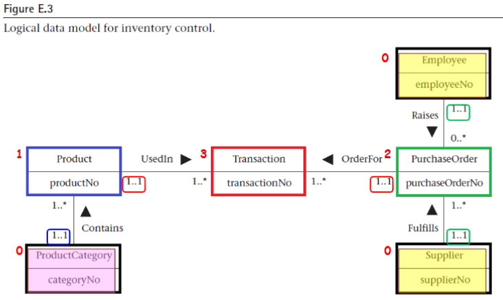

## 題目1

---

## Customer 客戶資料

| customerNo | customerName | customerStreet | customerCity | customerState | customerZipCode | custTelNo | custFaxNo | DOB | maritalStatus | creditRating |
| ---------- | ------------ | -------------- | ------------ | ------------- | -------------- | --------- | --------- | --- | ------------- | ------------ |
| C001 | 陳阿影 | 忠孝東路一段123號5樓 | 台北市 | 中正區 | 100 | 0912000001 | 02-12345678 | 1990-05-01 | 已婚 | A |
| C002 | 田小家 | 三多四路88號10樓 | 高雄市 | 苓雅區 | 802 | 0912000002 | 07-12345678 | 1985-11-23 | 未婚 | B |
| C003 | 陳大雨 | 公益路456號3樓 | 台中市 | 西區 | 403 | 0912000003 | 04-12345678 | 1992-07-15 | 已婚 | A |

## Employee 員工資料

| employeeNo | title | firstName | middleName | lastName | address | workTelExt | homeTelNo | empEmailAddress | socialSecurityNumber | DOB | position | sex | salary | dateStarted |
| ---------- | ----- | --------- | ---------- | -------- | ------- | ---------- | --------- | --------------- | -------------------- | --- | -------- | --- | ------ | ----------- |
| E001 | 經理 | 曉明 | | 王 | 台北市信義區松仁路100號 | 1001 | 0912000004 | wang@company.com | A123456789 | 1990-07-07 | 銷售經理 | 男 | 45000 | 2020-03-15 |
| E002 | 專員 | 阿辰 | | 周 | 台北市大安區敦化南路50號 | 1002 | 0912000005 | chou@company.com | B123456789 | 1985-11-29 | 銷售專員 | 男 | 35000 | 2021-05-20 |
| E003 | 專員 | 大雨 | | 林 | 台北市中山區南京東路200號 | 1003 | 0912000006 | lin@company.com | C123456789 | 1992-12-27 | 客服專員 | 女 | 32000 | 2022-01-10 |

## Product 產品資料

| productNo | productName | serialNo | unitPrice | quantityOnHand | reorderLevel | reorderQuantity | reorderLeadTime |
| --------- | ----------- | -------- | --------- | -------------- | ------------ | --------------- | --------------- |
| P001 | Pen | S-P001 | 10.00 | 500 | 100 | 200 | 7 |
| P002 | Notebook | S-P002 | 45.00 | 300 | 50 | 100 | 14 |
| P003 | USB Cable | S-P003 | 80.00 | 200 | 30 | 50 | 10 |

## PaymentMethod 付款方式

| pMethodNo | paymentMethod |
| --------- | ------------- |
| P01 | Credit Card |
| P02 | ATM Transfer |

## ShipmentMethod 運送方式

| sMethodNo | shipmentMethod |
| --------- | -------------- |
| S01 | EMS |
| S02 | Black Cat |

## Order 訂單資料

| orderNo | orderDate | billingStreet | billingCity | billingState | billingZipCode | promisedDate | status | customerNo | employeeNo |
| ------- | --------- | ------------- | ----------- | ------------ | -------------- | ------------ | ------ | ---------- | ---------- |
| O1001 | 2025-05-01 | 忠孝東路一段123號5樓 | 台北市 | 中正區 | 100 | 2025-05-03 | 已完成 | C001 | E001 |
| O1002 | 2025-05-05 | 忠孝東路一段123號5樓 | 台北市 | 中正區 | 100 | 2025-05-07 | 已完成 | C001 | E002 |
| O1003 | 2025-05-07 | 三多四路88號10樓 | 高雄市 | 苓雅區 | 802 | 2025-05-10 | 已完成 | C002 | E001 |
| O1004 | 2025-05-08 | 公益路456號3樓 | 台中市 | 西區 | 403 | 2025-05-11 | 已完成 | C003 | E003 |
| O1005 | 2025-05-09 | 公益路456號3樓 | 台中市 | 西區 | 403 | 2025-05-12 | 處理中 | C003 | E002 |
| O1006 | 2025-05-10 | 公益路456號3樓 | 台中市 | 西區 | 403 | 2025-05-13 | 處理中 | C003 | E003 |

## OrderDetail 訂單明細

| orderNo | productNo | quantityOrdered |
| ------- | --------- | --------------- |
| O1001 | P001 | 2 |
| O1001 | P002 | 1 |
| O1002 | P003 | 1 |
| O1003 | P002 | 3 |
| O1004 | P001 | 5 |
| O1005 | P003 | 2 |
| O1006 | P001 | 1 |

## Shipment 運送記錄

| shipmentNo | quantity | shipmentDate | completeStatus | orderNo | productNo | employeeNo | sMethodNo |
| ---------- | -------- | ------------ | -------------- | ------- | --------- | ---------- | --------- |
| SH001 | 3 | 2025-05-02 | 已完成 | O1001 | P001 | E001 | S01 |
| SH002 | 1 | 2025-05-06 | 已完成 | O1002 | P003 | E002 | S01 |
| SH003 | 3 | 2025-05-08 | 已完成 | O1003 | P002 | E001 | S02 |
| SH004 | 5 | 2025-05-09 | 已完成 | O1004 | P001 | E003 | S02 |
| SH005 | 2 | 2025-05-11 | 運送中 | O1005 | P003 | E002 | S01 |

## Invoice 發票資料

| invoiceNo | dateRaised | datePaid | creditCardNo | holdersName | expiryDate | orderNo | pMethodNo |
| --------- | ---------- | -------- | ------------ | ----------- | ---------- | ------- | --------- |
| I001 | 2025-05-02 | 2025-05-03 | 4111-2222-3333-4444 | 陳阿影 | 2027-12 | O1001 | P01 |
| I002 | 2025-05-06 | 2025-05-06 | ATM轉帳 | 陳阿影 | 不適用 | O1002 | P02 |
| I003 | 2025-05-08 | 2025-05-09 | 5111-2222-3333-5555 | 田小家 | 2026-10 | O1003 | P01 |
| I004 | 2025-05-09 | 2025-05-09 | ATM轉帳 | 陳大雨 | 不適用 | O1004 | P02 |
| I005 | 2025-05-10 | 2025-05-11 | 6111-2222-3333-6666 | 陳大雨 | 2028-04 | O1005 | P01 |
| I006 | 2025-05-11 | 未付款 | 4111-2222-3333-4444 | 陳大雨 | 2028-04 | O1006 | P01 |

## 題目2

## Employee 員工資料

| employeeNo | title | firstName  | lastName | address | workTelExt | homeTelNo | empEmailAddress | socialSecurityNumber | DOB | position | sex | salary | dateStarted |
| ---------- | ----- | ---------  | -------- | ------- | ---------- | --------- | --------------- | -------------------- | --- | -------- | --- | ------ | ----------- |
| E001 | 經理 | 曉明 |  王 | 台北市信義區松仁路100號 | 1001 | 0912000004 | wang@company.com | A123456789 | 1990-07-07 | 銷售經理 | 男 | 45000 | 2020-03-15 |
| E002 | 專員 | 阿辰 |  周 | 台北市大安區敦化南路50號 | 1002 | 0912000005 | chou@company.com | B123456789 | 1985-11-29 | 銷售專員 | 男 | 35000 | 2021-05-20 |
| E003 | 專員 | 大雨 |  林 | 台北市中山區南京東路200號 | 1003 | 0912000006 | lin@company.com | C123456789 | 1992-12-27 | 客服專員 | 女 | 32000 | 2022-01-10 |

### ProductCategory 產品類別
| categoryNo | categoryDescription |
| ---------- | ------------------- |
| C001       | 電子產品            |
| C002       | 辦公用品            |
| C003       | 家具用品            |

### Product 產品資訊
| productNo | productName | serialNo  | unitPrice | quantityOnHand | reorderLevel | reorderQuantity | reorderLeadTime | categoryNo |
| --------- | ----------- | --------- | --------- | -------------- | ------------ | --------------- | --------------- | ---------- |
| P001      | 筆記型電腦  | SN001ABC  | 25000     | 15             | 5            | 10              | 7               | C001       |
| P002      | 辦公桌      | SN002XYZ  | 8000      | 8              | 3            | 5               | 14              | C003       |
| P003      | 印表機      | SN003DEF  | 4500      | 12             | 4            | 8               | 10              | C001       |

### Supplier 供應商資料
| supplierNo | supplierName      | supplierStreet    | supplierCity | supplierState | supplierZipCode | suppTelNo     | suppFaxNo     | suppEmailAddress        | suppWebAddress         | contactName | contactTelNo  | contactFaxNo  | contactEmailAddress     | paymentTerms     |
| ---------- | ----------------- | ----------------- | ------------ | ------------- | --------------- | ------------- | ------------- | ----------------------- | ---------------------- | ----------- | ------------- | ------------- | ----------------------- | ---------------- |
| S001       | Great Supplies Co.| 忠孝東路100號     | 台北市       | 台灣          | 10608           | 02-2345-6789  | 02-2345-6780  | info@greatsupplies.com  | www.greatsupplies.com  | 陳經理      | 0912-123-123  | 02-2345-6780  | chen@greatsupplies.com  | 月結30天         |
| S002       | EasyBuy Ltd.      | 復興南路200號     | 台北市       | 台灣          | 10667           | 02-3456-7890  | 02-3456-7891  | contact@easybuy.com     | www.easybuy.com        | 林主任      | 0923-234-234  | 02-3456-7891  | lin@easybuy.com         | 月結45天         |
| S003       | TechWorld Inc.    | 民生東路300號     | 台北市       | 台灣          | 10489           | 02-4567-8901  | 02-4567-8902  | service@techworld.com   | www.techworld.com      | 黃經理      | 0934-345-345  | 02-4567-8902  | huang@techworld.com     | 月結60天         |

### PurchaseOrder 採購訂單
| purchaseOrderNo | purchaseOrderDescription | orderDate  | dateRequired | shippedDate | freightCharge | supplierNo | employeeNo |
| --------------- | ------------------------ | ---------- | ------------ | ----------- | ------------- | ---------- | ---------- |
| PO001           | 第一季電腦採購           | 2025-03-30 | 2025-04-15   | 2025-04-12  | 500           | S001       | E001       |
| PO002           | 辦公室傢俱更新           | 2025-04-01 | 2025-04-20   | 2025-04-18  | 1200          | S002       | E002       |
| PO003           | 辦公設備補充             | 2025-04-03 | 2025-04-25   | 2025-04-22  | 800           | S003       | E003       |

### Transaction 交易記錄
| transactionNo | transactionDate | transactionDescription | unitPrice | unitsOrdered | unitsReceived | unitsSold | unitsWastage | productNo | purchaseOrderNo |
| ------------- | --------------- | ---------------------- | --------- | ------------ | ------------- | --------- | ------------ | --------- | --------------- |
| T001          | 2025-04-20      | 筆記型電腦進貨         | 25000     | 10           | 10            | 0         | 0            | P001      | PO001           |
| T002          | 2025-04-22      | 印表機進貨             | 4500      | 5            | 5             | 0         | 0            | P003      | PO003           |
| T003          | 2025-04-25      | 辦公桌進貨             | 8000      | 15           | 15            | 0         | 0            | P002      | PO002           |

